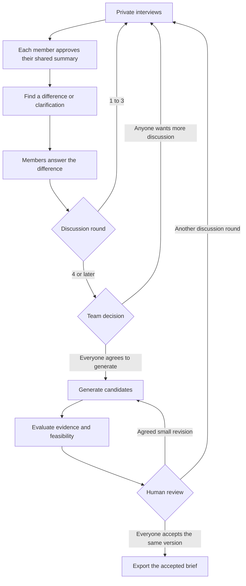

# Considea

Considea helps a small team choose a project together. Each person talks privately with an interview agent, approves what to share, and answers the differences that matter. The team decides when to generate ideas and which evaluated version to accept.

## Try it

- [Development workspace](https://considea-dev-api.onrender.com): real model and web-research calls, separate from production. Use a team demo code or your own DeepSeek and Tavily keys.
- [Production website](https://considea.vercel.app): the existing master deployment. Its backend is currently a labelled mock demo.
- [Setup and deployment](DEPLOYMENT.md), [workflow and HTTP API](workflow/README.md), [agent integration](workflow/INTEGRATION.md).

The free development server can take a moment to wake up. The development database is a 30-day Render PostgreSQL instance that expires on **November 3, 2026**. Export accepted briefs and migrate the database before expiry if you need to keep using it.

## The conversation



Every round requires human answers. Round 4 opens a choice; it does not automatically start generation. A revised candidate gets a new evaluation and fresh approvals. Silence, model advice and exhausted budgets never count as agreement.

## Run locally

Use Python 3.10+, Node 24 and pnpm 11.19.0. From the repository root:

```sh
python -m pip install -r workflow/requirements.txt
python -m workflow
```

Open `http://127.0.0.1:8765` for a labelled mock workspace. For the actual teammate agents, install the packages listed in [INTEGRATION.md](workflow/INTEGRATION.md), then run:

```sh
python -m workflow --mode integrated --model offline --evaluator agent
```

For real calls, copy `.env.example` to `.env` without overwriting existing keys. Set the provider keys, a demo access code and a persistent encryption key, then use `--model live`. The application reads only the repository-root `.env`; existing process variables take precedence. No model or search key is published to the frontend.

## Components

| Component | Responsibility |
| --- | --- |
| Interview | Private questions, follow-up and a summary the member can edit |
| Negotiator | Rank differences in approved shared information; currently Python rules |
| Idea Generator | Generate or revise candidates from the authorized discussion history |
| Evaluator | Research similar projects and technical feasibility with a source ledger |
| Workflow | Authentication, human decisions, versions, task leases, limits and persistence |
| Web workspace | Invitations, private interviews, shared decisions, recovery and brief export |

The workflow uses PostgreSQL when `DATABASE_URL` is set and SQLite otherwise. Private history remains in the workflow database. Optional SpacetimeDB integration publishes the approved shared board and stores Idea jobs. Mem0 support exists in the Idea package but is disabled in the integrated workflow.

Room access uses invitations and bearer credentials, not a full account service. Members can download private recovery cards. User-supplied room keys are encrypted, isolated per call, replaceable and removable. See [access and key handling](docs/ACCESS-AND-KEYS.md).

## Tests and development

```sh
python -m unittest discover -s workflow/tests -v
python agent/interfaces/validate_contracts.py
node --test deploy/tests/*.test.mjs
```

CI checks the deployment image, all agent packages, PostgreSQL transactions and a complete browser flow with simulated responses. Real API acceptance is separate and uses synthetic participants. Passing a technical test does not prove interview quality or project novelty. Evidence for this development release is collected in [DEV-ACCEPTANCE.md](docs/DEV-ACCEPTANCE.md).

New features are committed on feature branches and integrated into `dev`. `master` is left unchanged until the team accepts the development release.
