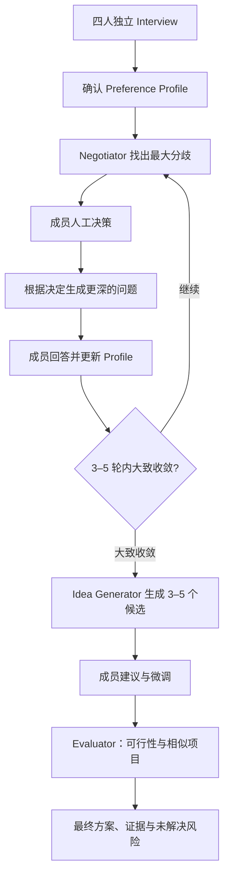

# IdeaSync - Sync your perspectives. Shape better ideas. Move faster

面向 Hackathon 团队：先分别听懂每个人，找出真正影响方向的分歧，由成员做关键决定，再把讨论推进到更深层。方向大致收敛后，才生成候选方案并做可行性验证。

> **当前状态：产品设计与 MVP 计划。** 本文描述目标行为，功能尚未实现。首版用文字访谈，开发窗口 18 小时，场景是四人团队。状态机、数据对象和验收见 [workflow_updated.md](workflow_updated.md)。

## 1. 要解决的问题

四个人组队后，通常还不了解彼此真正想做什么。一个人提出方案，其他人立刻从实用性、难度、赛道和“有没有人做过”反对。几轮之后，大家更不愿意提新想法，却仍然没有共同标准。

AI 负责发现问题和组织讨论。最终价值判断由成员自己做。

## 2. 核心流程

讨论轮数建议 3–5，首版默认 4。首轮是基础访谈，之后每一轮问题都由上一轮的真实人工决定生成。

- 私人回答在本人批准共享之前，不进入团队上下文。
- 人工决策由成员亲自完成，未回复不等于支持。
- 后续问题追问原因、改变条件和愿意牺牲的部分。
- Idea Generator 使用完整讨论历史。
- Evaluator 在候选成形、并经过成员微调之后运行。
- 轮数结束、沉默或多数同意，都不会被写成全员共识。达到上限仍有关键分歧时，保存讨论成果并进入 `unresolved`。

## 3. 从访谈到共同方向

**创建房间。** 填写成员、比赛背景、硬约束、讨论轮数、候选数量上限，以及是否允许外部搜索和调用预算。

**Round 0。** 四人并行私人访谈：真实问题、想做和不想做的事、技能与资源、比赛目标、已有想法里想保留的部分。这一步建立 Preference Profile，直接出产品留到后面。

**确认画像。** 字段包括问题、目标用户、兴趣、技能、期望体验、限制、可妥协项和目标，并附证据与置信度。本人可以改写、删除，或标出“这是我说过的”和“这是推断，我不同意”。只有确认后的字段进入共享上下文。

**最大分歧。** Negotiator 比较用户、痛点、产品形态、技术路线、创新与实用性、复杂度和风险容忍，提出当前最该先解决的一个分歧。排序看对最终方向的影响：两个人之间的关键路线分歧，可以比四个人对一个次要功能的分歧更重要。输出可以是 0/1，也可以是开放问题，并说明为什么重要、影响谁。

**人工决策。** Workflow 把分歧转成成员可以回答的题目。相关成员必须亲自作答。系统保存原始选择和时间戳。成员可以看到这是 AI 挑出的关键分歧，也可以不接受 AI 对分歧的解释。

**更深的访谈。** 下一轮依据当前画像、本轮决定、已经问过的问题和尚未解释清楚的原因来出题。问题从“你想解决什么”，推进到“为什么”，再推进到“什么条件会改变你的判断”，最后到“在明确约束下你愿意牺牲什么”。

**收敛。** 关键用户和核心问题基本一致，价值主张不再大幅漂移，剩下的差异主要是实现细节，或可以放进候选方案里处理的取舍。系统标记 `high_divergence`、`medium_divergence`、`low_divergence` 或 `stable`，团队选择仍由成员完成。最少 3 轮；第 3 轮后若已经 `stable`，可以提前结束讨论；第 5 轮结束进入 Idea Generation。

## 4. 候选、微调与验证

**Idea Generator** 读取每人最终画像、每轮分歧、对应的人工决定、被保留和被放弃的偏好、共同方向，以及比赛约束，生成 3–5 个候选。每条包含名称、用户、问题、机制、为什么适合这个团队、讨论追溯、取舍、MVP 和未决问题。候选之间要有真实不同的取舍。

**成员微调。** 可以保留、删除、合并，或修改用户、功能、AI 参与程度和 MVP 范围。每次修改产生新版本；旧版留作历史，确认状态不继承到新版。

**Evaluator** 检查 API、数据、设备、时间内能否做出 MVP、相似公开项目和具体差异。结论分成 `verified`、`supported_by_source`、`team_claim`、`needs_test`、`unknown`。搜索失败可以返回 `partial`，流程继续。

**最终结果** 包含当前方案、候选如何演化、关键偏好、已经做出的人工决定、可行性、相似项目与差异、已知风险，以及仍未解决的问题。

## 5. 角色与权限

| 角色 | 职责 |
| --- | --- |
| Interview Agent | 私人访谈，起草 Preference Profile，并根据人工决定提出更深的问题 |
| Negotiator Agent | 从已共享画像中找出当前最大分歧 |
| Idea Generator Agent | 用完整讨论轨迹合成 3–5 个候选 |
| Evaluator Agent | 可行性、相似项目和技术条件检查，附来源与未知项 |
| Workflow | 应用代码。管理身份、权限、轮次、版本、任务和确认，并执行 Agent 的行动提案 |

Agent 通过结构化输入输出进入 Workflow。批准时间、决策、轮次、候选版本、最终状态和成员确认由应用逻辑写入。私人访谈、画像草稿、已批准的共享画像和团队讨论分开存储。公共候选、来源标签和进度事件不能带出未授权的私人回答。

## 6. 四个页面

1. **Room：** 比赛背景、成员、讨论轮数、当前阶段、整体进度。
2. **Private Interview：** 当前问题、回答、画像草稿、确认共享 / 修改 / 删除、已完成轮次。
3. **Team Workbench：** 已共享偏好、当前最大分歧、等待回答的人工决策、每轮讨论轨迹、Agent 进度。
4. **Final Idea：** 候选、成员修改、最终版本、评估报告、风险与未知项、最终确认。

## 7. 18 小时计划

| 时间 | 必须完成 |
| --- | --- |
| 0–1h | Room、Profile、Divergence、Decision、Idea、Evaluation 的数据结构 |
| 1–4h | 四人并行访谈和画像确认 |
| 4–7h | 汇总画像，生成最大分歧 |
| 7–9h | 人工决策，以及下一轮深度访谈 |
| 9–11h | 打通 3–5 轮循环和收敛状态 |
| 11–13h | 生成多个候选 |
| 13–15h | 成员微调和版本 |
| 15–17h | Evaluator 与来源展示 |
| 17–18h | 完整 Demo：权限、轮数、版本、失败恢复 |

首版做文字访谈、房间内独立身份、简单来源展示，以及一条“分歧 → 人工决定 → 更深追问”的完整循环。语音和自动写代码留到后面。模型、数据库、搜索服务和调用预算尚未指定。

## 8. Demo

四个人先分别回答最近最想解决的真实问题。系统先得到四份画像。

Negotiator 指出一个高影响分歧，例如三个人希望高度自动化，另一人认为 AI 不该替用户做关键决定。相关成员亲自回答后，后面的轮次继续问“为什么”，以及“什么条件会改变这个判断”。

3–5 轮后，Idea Generator 给出多个候选。成员可以缩小 MVP 或删掉某个功能。Workflow 保存新版本，再交给 Evaluator。

团队最后看到的是自己讨论、决定和修改出来的方案。AI 把最值得讨论的问题找出来，并把讨论推进到更深层。

## 9. MVP 成功标准

- 四个人可以同时完成独立访谈；未批准内容不进入公共输出；画像能追溯到原始回答。
- Negotiator 能提出高影响分歧，0/1 和开放问题都由相关成员亲自回答。
- 人工决定记录之后，才生成下一轮问题；问题引用该决定，并且比上一轮更深。
- 讨论限制在 3–5 轮。大致收敛后停止继续追问。
- 候选使用完整讨论历史，彼此有真实取舍，并能追溯到具体讨论或决定。
- 成员修改产生新版本；旧确认不带到新版。
- Evaluator 分清已验证、有来源、成员自述、待测试和未知。搜索失败显示 `partial`，不挡住流程。
- 最终页同时展示讨论、决定、修改和评估。未解决的关键分歧保留下来。

再用真实团队看：偏好是否被理解、真正的分歧是否更容易被发现、最终方案是否更容易被接受并开始做。
