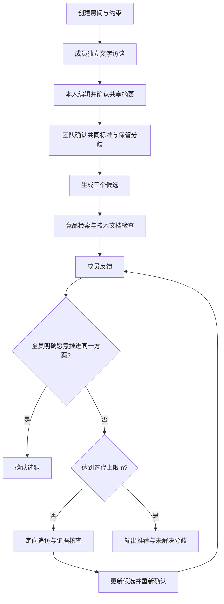

# MHacks — AI 选题协调员

面向 Hackathon 团队：先分别听懂每个人，再帮团队形成、调查和改进候选方案，直到成员愿意共同推进，或清楚知道分歧在哪里。

> **当前状态：产品设计与 MVP 计划。** 本 README 根据团队选题访谈整理，描述目标行为，不代表功能已经实现。首版采用文字访谈，语音留作后续扩展；开发窗口为 18 小时，首个使用场景为四人团队。具体赛道要求、技术栈与成员技术能力仍需核实。

团队分工已确定为：三人分别负责 **Interview Agent、Negotiate Agent、Evaluator Agent**，第四人负责整体 workflow 搭建。各模块职责、输入输出和验收见 [agent/ 设计文档](agent/README.md)。

**发布计划：Considea 作为同一个 MAS 项目参赛，三个 Agent 分别注册到 Agentverse；目前先接入 Interview，随后接入 Negotiate 与 Evaluator，并汇总到同一份团队项目提交。** Interview 的独立调用入口用于分阶段联调，不改变三 Agent 架构。

本 `agent/interview` 分支已提供 Interview Agent 本地体验和 [Agentverse 接入](agent/interview/agentverse/README.md)，包含持久档案、人工审核导出与 ACP 服务。**Considea Interview 已注册，ASI 的帮助命令已实测往返成功**；完整 ASI 访谈流程和比赛提交仍未完成。新路径已完成 3 次有效模型调用和 1 次失败调用，本次测试额度已耗尽；当前临时服务需要本机及隧道保持运行。完整团队流程仍按下文设计开发。

- Agent 名称：**Considea Interview**
- 地址：`agent1qvn23uk8egw36xpzl7k3nyw0tk7yvadtwqstqn3ch4yrh23hu7qhxhjvdzc`
- [Agentverse 档案](https://agentverse.ai/agents/details/agent1qvn23uk8egw36xpzl7k3nyw0tk7yvadtwqstqn3ch4yrh23hu7qhxhjvdzc/profile) · [ASI 对话入口](https://asi1.ai/ai/agent1qvn23uk8egw36xpzl7k3nyw0tk7yvadtwqstqn3ch4yrh23hu7qhxhjvdzc)

## 1. 要解决的问题

四个人组队后，通常还不了解彼此真正想做什么。一个人提出方案，其他人马上从实用性、技术难度、赛道适配、是否有人做过等角度反对。几轮之后，大家越来越不愿意提出新想法，却仍然没有明确的共同标准。

产品需要完成三件事：

- 挖出每个人尚未表达清楚的痛点、兴趣、能力和顾虑。
- 把这些输入转化成几个适合当前团队的候选方案。
- 遇到反对时，查清分歧、补充证据、调整方案，帮助团队继续前进。

**AI 有推荐权，最终决定始终由团队作出。** 任何成员主观上不愿意做，都足以触发协商，不需要先证明理由客观成立。

## 2. 核心用户流程

### 2.1 创建房间

发起人填写比赛主题、剩余时间、已知硬约束，以及最多允许的选题迭代轮数 `n`，再邀请其他成员加入。

比赛链接可作为输入。没有核实的赛道要求标为“待确认”，不能直接作为淘汰理由。当前提及的 Fetch.ai／MHacks 实时相关赛道适配仍待核实。

### 2.2 独立访谈

每位成员进入自己的文字聊天。**首次访谈最多 7 轮，每轮约 3 个问题，信息足够可提前结束。** 问题根据回答调整，主要覆盖：

- 最近真实遇到的麻烦，以及当前如何解决。
- 擅长或想尝试的技术、能获得的数据与资源。
- 已有想法，以及其中最想保留的体验。
- 对其他方向的顾虑、不能接受的条件、愿意参与的修改方式。
- 对有趣、实用、比赛表现、学习机会等目标的偏好。

没有现成 idea 的成员，也可以通过生活经历和约束贡献信息。重点从真实痛点、技能与资源、对已有方案的顾虑及修改条件切入。

### 2.3 个人摘要确认与共享

AI 生成可编辑摘要卡，由本人确认后共享。

摘要包含“想解决什么、想做什么、能贡献什么、顾虑是什么、哪些条件可以商量”。成员可以修改措辞或删除内容。

**原始访谈默认私有。** 团队整合和公共看板使用已确认的信息；后续追访产生的新信息，也需要本人确认后才能公开。访谈 Agent 可使用对应成员的私人上下文，但不能通过候选理由、来源图或进度消息间接公开未获授权的内容。

### 2.4 确认团队标准

设计建议：生成候选前，展示已知硬约束、共同偏好和分歧，由团队确认或修改。

没有达成一致的偏好继续保留，不强行生成一个统一分数，也不由房主单方面代表全队。共同标准的具体确认交互尚待确定。

## 3. 三个候选的内容

每个候选使用同一套卡片：

| 内容 | 要回答的问题 |
| --- | --- |
| 用户与场景 | 谁会在什么情况下使用？ |
| 核心体验 | 用户完成哪件事，获得什么结果？ |
| 团队适配 | 用到了谁的观察、技能、资源或偏好？ |
| 最小 demo | 本次比赛具体展示哪一条完整流程？ |
| 类似项目 | 最接近的公开项目是什么，有哪些重合？ |
| 具体差异 | 我们准备改善哪个环节，证据是否充分？ |
| 技术条件 | 关键接口、数据和设备是否可获得？ |
| 风险与取舍 | 谁可能不愿参与，哪里仍未验证？ |
| 推荐理由 | 为什么值得当前团队投入剩余时间？ |

三个方案应有实质不同的取舍，不只是同一个产品的三个名称。无需将每个人的所有要求都塞进每个方案。

“想法来源”必须能追溯到已确认的成员摘要。AI 自己提出的组合或推断单独标明，不能伪装成成员意见。

## 4. 首版验证的边界

首版完成两类检查：

### 4.1 竞品检查

检索公开项目和产品，提供来源，比较用户场景、功能和交互的重合。区分“已经实现”“项目方声称实现”“未来计划”。找到相似项目后，帮助定位差异，不自动淘汰方案。

没有搜到同类项目，只能表示本次检索未发现，不能宣称全球首创。“查重”在此指相似项目检索与比较，并非穷尽性的新颖性认定。

### 4.2 技术检查

优先读取官方文档，核实关键 API、访问要求、数据来源、设备依赖和已公开的限制。将结果分成“文档支持”“成员自述”“待实际测试”。

首版不承诺运行原型验证，也不把网络检索称为真实市场需求验证。**组员喜欢、外部用户需要、技术能够实现，是三类不同的结论。**

## 5. 协商 Agent 如何工作

成员对候选提交以下反馈之一：

- 愿意推进。
- 有顾虑，满足条件后愿意。
- 不愿推进。
- 暂未决定。

只要有人明确反对，就进入协商；主观不喜欢也是有效输入。未回复不等于同意，有条件支持也不等于无条件确认。

协商 Agent 根据当前分歧选择下一步：

| 当前情况 | 下一步 |
| --- | --- |
| 不清楚反对的原因 | 私下追问该成员，帮助表达顾虑 |
| 对技术条件存在不同判断 | 找掌握信息的人核实，并补查文档 |
| 题目可以接受，但不想承担某类工作 | 讨论分工或缩减范围 |
| 两人的目标不同 | 展示取舍，提出修改版或替代候选 |
| 新证据改变了判断基础 | 更新候选和来源，再征求反馈 |
| 关键分歧仍无法调和 | 保留反对意见，推荐其他路径 |

追问应允许回答“都不是，实际原因是……”，避免 Agent 过早给成员贴标签。协商不是强迫反对者接受原方案；保留修改、替换或放弃候选的可能。

例如：A 担心语音延迟，B 表示有现成接口。Agent 可以先找 B 核实，再询问 A：降低实时程度是否能接受。只有 A 自己更新态度，系统才记录该顾虑已解决。B 的经验应标为成员自述，不自动升级为已验证事实。

当前执行权限建议：普通追问与只读检索可自动推进；改变方向、扩大范围或重新解释成员意愿，需要团队或相关成员确认。

## 6. 迭代与结束规则

首次访谈的 7 轮上限，与后续选题迭代 `n` 轮分别计数。`n` 由用户在房间中设置。

工程口径建议：首次候选展示记为第 1 轮，总共最多展示 n 个候选轮次；初访准备不计入 n。每次发布修订候选进入下一轮，失败、重试和未批准的草稿不计数。创建房间时向用户解释该口径。

每轮反馈后的协商流程为：

> 成员反馈 → 有针对性的追访与核查 → 更新候选 → 再次收集反馈。

一次迭代内的追访也应有明确问题量上限，防止 `n` 轮内部无限追问。首版工程建议为每名成员每轮最多一组、每组 1–3 问，做成可配置项。

结束有三种状态：

| 状态 | 条件与输出 |
| --- | --- |
| 已达成共识 | 所有成员明确愿意推进同一版本的方案，没有未解决的反对 |
| 达到迭代上限 | 输出推荐方案、分歧、可妥协条件和下一步建议，标记“尚未达成共识” |
| 团队主动结束 | 保留当前成果，由成员接手决定 |

**AI 不得因为轮数用完、某人沉默或多数人同意，就自动宣布全队达成共识。**

## 7. Agent 分工与系统边界

| 角色 | 职责 |
| --- | --- |
| Interview Agent | 初访与定向追访，生成待本人确认的摘要，隔离私人上下文 |
| Negotiate Agent | 整合共享摘要生成三个候选；分析分歧、提出追访/核查/修订计划和推荐 |
| Evaluator Agent | 检索类似项目与技术文档，输出有来源的比较、可行性条件和未知项 |

Workflow 由第四位成员负责，用程序管理状态、共享权限、任务、版本、轮数和用户确认；它不是第四个 Agent。原来的整合职责归 Negotiate，研究职责归 Evaluator。详细契约见 [共享输入输出](agent/contracts.md)。

这些角色可以复用同一个模型，以不同上下文和权限运行，无需为了演示而接入多个模型。

应用程序负责身份、共享权限、轮数、候选版本、反馈状态和最终确认。Agent 提出下一步行动，由程序检查后执行。

每条反对意见都要关联具体候选版本；方案修改后，需要相关成员重新确认，不能把旧版的同意直接继承到新版。最终共识只依据所有成员对当前版本的明确确认。

建议的数据对象包括：房间与约束、成员私人访谈、获准共享的摘要及版本、候选及版本、外部证据、成员反馈、协商任务、迭代记录与结束状态。

## 8. 首版界面

只做三个主要页面：

1. **房间入口：**创建／加入、比赛信息、时间与 `n` 的设置。
2. **私人访谈：**聊天、进度、可编辑的共享摘要。
3. **团队工作台：**集中展示以下四部分。

| 工作台部分 | 展示内容 |
| --- | --- |
| 三张候选卡片 | 推荐理由、竞品、最小 demo、风险 |
| 想法来源 | 候选与成员已确认痛点、技能、偏好的对应关系 |
| 共识与分歧 | 成员已授权共享的态度、仍卡住的问题、待确认事项 |
| Agent 工作进度 | 当前动作、原因、检索结果、等待谁回答 |

来源关系首版用列表或连线卡片即可。Agent 进度显示真实状态，例如“正在核实地图接口是否需要审批”，不展示虚构的内部思考过程，也不泄露私人访谈。

文字是首版入口。后续可接入语音技术栈或模型，沿用相同的摘要确认、共享权限和协商流程。

## 9. 18 小时交付计划

建议四人各负责一条主线，前 1 小时共同确定数据结构和接口。以下为计划，尚未确认各成员技术能力。

| 时间 | 必须完成的结果 |
| --- | --- |
| 0–1h | 定义页面、共享摘要、候选、证据、反馈和协商任务格式 |
| 1–5h | 四人可加入同一房间，各自访谈并确认摘要 |
| 5–9h | 从共享摘要生成三个候选，加入竞品与技术来源 |
| 9–13h | 完成反馈、一次定向追访、候选更新与重新确认 |
| 13–16h | 接通整个流程，检查共享边界、轮数与结束状态 |
| 16–18h | 演练 demo、处理失败提示、准备讲解与录像 |

确定的四人分工：

- 成员 1：[Interview Agent](agent/interview-agent.md)。
- 成员 2：[Negotiate Agent](agent/negotiate-agent.md)，含候选整合与协商。
- 成员 3：[Evaluator Agent](agent/evaluator-agent.md)，含检索与评估。
- 成员 4：[Workflow](agent/workflow.md)，含整体调度、状态权限和简单界面接线。

四人共同确认 [数据契约](agent/contracts.md) 并完成联合验收，避免三套输出无法接入。

本次优先做文字、邀请链接、简单来源展示和一个完整协商循环。语音、复杂动态图、自动代码生成和客户访谈留待后续。模型、框架、数据库、搜索服务与部署环境尚未指定。

## 10. Demo 故事

四名成员先分别表达痛点、能力和限制。系统生成三个候选，并展示每个方向来自谁的输入。

一名成员反对推荐方案。协商 Agent 判断问题所在，只追问相关成员，补充一条技术或竞品证据，再更新方案。工作台明确展示：

- 原方案为什么被反对。
- 补充了什么信息。
- 方案改了哪里。
- 哪些成员重新确认了意愿。

演示不必保证最后人人同意。准确保留无法解决的分歧，也是产品正确工作的结果。

## 11. 如何判断 MVP 成功

先验证流程正确：

- 未确认的私人内容不会进入公共输出。
- 每个候选能追溯到成员输入，AI 推断有明确标记。
- 主观反对能触发相应协商，不会被多数意见覆盖。
- 研究结论有来源，未知项不会被写成已验证。
- 方案更新后重新确认，沉默不视为同意。
- 达到 `n` 轮后正确停止，不伪造共识。

再验证产品价值：让真实团队使用，观察从加入房间到明确候选的时间、成员是否认为自己的观点被准确表达，以及最终是否愿意开始做第一个功能。记录实际结果，不预先承诺效率提升或比赛获奖。

**核心承诺：让每个人被听懂，让每个候选有依据，让团队知道下一步怎么走。**

## 12. 仍待确认的设计项

- 比赛官方规则及 Fetch.ai／实时相关赛道的准确要求。
- 团队共同标准的确认交互，以及硬约束与个人偏好的区分方式。
- 每次迭代内部的追访上限及候选轮数工程口径的最终配置。
- 普通追问自动执行、重大变化交由团队确认的具体交互。
- 三 Agent 与 workflow 分工内的具体技术栈、可用服务与运行预算。

这些项目不影响当前产品方向，但实现前应逐项明确；尚未确认的建议不能作为成员已经同意的事实。
