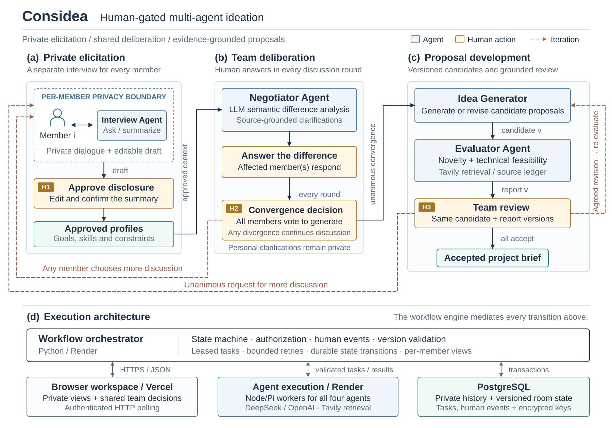
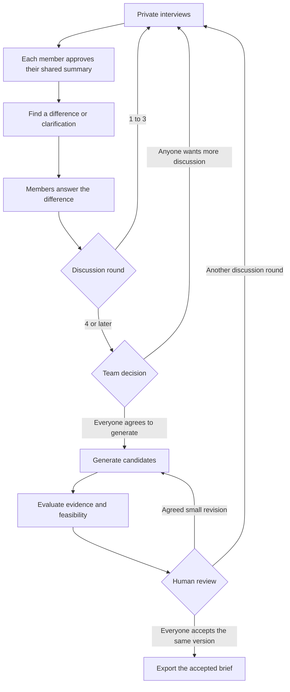

# Considea
Considea aligns small teams on what to build next. Through iterative private interviews, our AI uncovers each member’s skills, preferences, and perspective gaps. It then bridges those differences to generate tailored project directions—evaluated collaboratively by AI and the team to reach high-conviction consensus.

## Try it

- [Production website](https://considea.vercel.app): real DeepSeek and Tavily calls with PostgreSQL persistence. Use a team demo code or your own keys.
- [Direct backend workspace](https://considea-dev-api.onrender.com): the same live service and saved rooms. The existing hostname is retained after promotion.
- [Concept demo and saved results](https://considea.vercel.app/demo.html): no account, keys or live calls required. [Download the video](workflow/web/demo.mp4).
- Development previews use a separate labelled mock backend.
- [Setup and deployment](DEPLOYMENT.md), [workflow and HTTP API](workflow/README.md), [agent integration](workflow/INTEGRATION.md).
- [Agentverse / ASI:One adapter](docs/AGENTVERSE.md): optional chat access to the same workflow; new shared endpoints await deployment and registration.

The free live server can take a moment to wake up. The database is a 30-day Render PostgreSQL instance that expires on **November 3, 2026**. Export accepted briefs and migrate the database before expiry if you need to keep using it.

## Architecture



All four roles use LLMs in integrated live mode, with DeepSeek or OpenAI selected per room. The Negotiator interprets approved shared evidence to identify a consequential difference or clarification; code validates its output, member identities and citations. Human gates control disclosure, generation and acceptance. The workflow orchestrator mediates every transition, keeps personal clarifications private and persists state in PostgreSQL. The diagram shows the production architecture and excludes inactive optional integrations.

## The conversation



Every round requires human answers. Round 4 opens a choice; it does not automatically start generation. A revised candidate gets a new evaluation and fresh approvals. Silence, model advice and exhausted budgets never count as agreement.

## Run locally

Use Python 3.10+, Node 24 and pnpm 11.19.0. From the repository root:

```sh
python -m pip install -r workflow/requirements.txt
python -m workflow
```

Open `http://127.0.0.1:8765` for a labelled mock workspace. For the actual teammate agents, install the packages listed in [INTEGRATION.md](workflow/INTEGRATION.md), then run:

```sh
python -m workflow --mode integrated --model offline --evaluator agent
```

For real calls, copy `.env.example` to `.env` without overwriting existing keys. Set the provider keys, a demo access code and a persistent encryption key, then use `--model live`. The application reads only the repository-root `.env`; existing process variables take precedence. No model or search key is published to the frontend.

## Components

| Component | Responsibility |
| --- | --- |
| Interview | Private questions, follow-up and a summary the member can edit |
| Negotiator | Use an LLM to identify semantic differences and clarifications in approved shared evidence |
| Idea Generator | Generate or revise candidates from the authorized discussion history |
| Evaluator | Research similar projects and technical feasibility with a source ledger |
| Workflow | Authentication, human decisions, versions, task leases, limits and persistence |
| Web workspace | Invitations, private interviews, shared decisions, recovery and brief export |

The workflow uses PostgreSQL when `DATABASE_URL` is set and SQLite otherwise. Private history remains in the workflow database. Optional SpacetimeDB integration publishes the approved shared board and stores Idea jobs. Mem0 support exists in the Idea package but is disabled in the integrated workflow.

Room access uses invitations and bearer credentials, not a full account service. Members can download private recovery cards. User-supplied room keys are encrypted, isolated per call, replaceable and removable. See [access and key handling](docs/ACCESS-AND-KEYS.md).

## Tests and development

```sh
python -m unittest discover -s workflow/tests -v
python agent/interfaces/validate_contracts.py
node --test deploy/tests/*.test.mjs
```

CI checks the deployment image, all agent packages, PostgreSQL transactions and a complete browser flow with simulated responses. Real API acceptance is separate and uses synthetic participants. Passing a technical test does not prove interview quality or project novelty. Evidence for this development release is collected in [DEV-ACCEPTANCE.md](docs/DEV-ACCEPTANCE.md).

New features are committed on feature branches and integrated into `dev`. Accepted releases are merged into `master`. The live backend follows `master` and uses controlled manual deployments; see [DEPLOYMENT.md](DEPLOYMENT.md).
