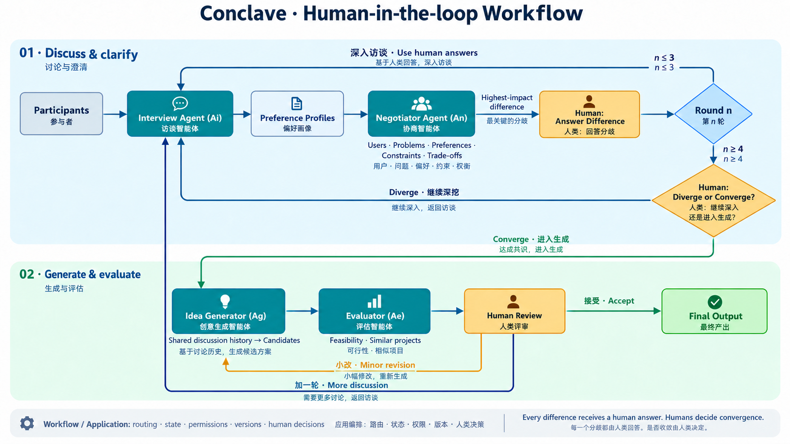
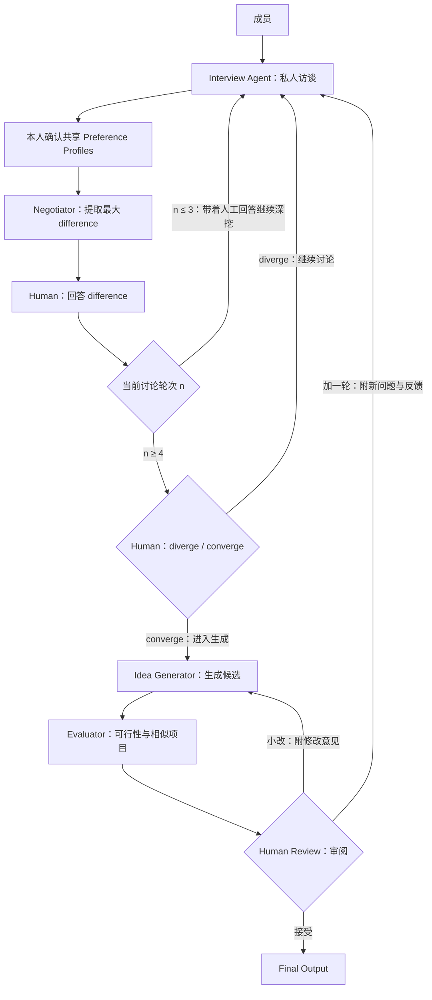

# Conclave — AI 选题协调员

面向 Hackathon 团队：先分别理解成员，通过访谈、分歧识别和真实人工回答逐步澄清方向；由成员决定何时收敛，再生成候选、评估并审阅。

> **当前状态：Workflow 已实现，可离线联调。** Python 状态机、SQLite 持久化、HTTP 接口和本地工作台位于 [workflow/](workflow/README.md)。默认使用明确标记的 mock Agent；四个业务 Agent 由队友按 v2.0 契约接入，真实模型与检索效果尚未验收。

## 本地运行

在仓库根目录执行：

```powershell
python -m pip install -r workflow/requirements.txt
python -m workflow
```

打开 http://127.0.0.1:8765 ，创建房间、保存管理员令牌，将每个成员的邀请码分别交给本人。每个成员在独立浏览器标签页加入并完成私人访谈。启动参数、HTTP 输入输出、Agent 接入和恢复规则见 [Workflow 开发说明](workflow/README.md)。

## 系统图



完整的流程、difference 定义、状态转换和待确认项见 [Workflow 设计](workflow_updated.md)。[Agent 目录](agent/README.md) 说明当前角色与现有代码的关系。

## 核心流程



每轮先由 Interview 形成偏好画像，再由 Negotiator 找出对最终方向影响最大的分歧，相关成员亲自回答。下一轮访谈使用这些回答继续追问原因、改变判断的条件和可接受的取舍。

- **当 `n ≤ 3`：** Human 回答 difference 后返回 Interview，充分澄清分歧。
- **当 `n ≥ 4`：** Human 回答 difference 后，人工决定 `diverge` 或 `converge`；前者返回 Interview，后者进入 Idea Generator。
- 每轮都必须经过 Human 回答。Negotiator 没有绕过 Human 直接回访的路径。
- 轮数达到门槛不自动生成候选；模型的收敛建议不能替代人工决定。本架构没有规定“最多 5 轮自动生成”或“第 4 轮自动停止”。
- 生成后的顺序是 **Idea Generator → Evaluator → Human Review**。
- Human Review 可以接受并输出；小改交回 Idea Generator，修订后重新评估和审阅；加一轮则回到 Interview，重新经过分歧识别和人工节点。

这里的 `n` 表示团队讨论轮次。个人访谈的一组问答、Pi 内部一次模型/tool turn、候选版本都有各自的计数，不能混用。实现从 n=1 开始，每次回到新一轮 Interview 时递增；生成后加一轮继续原编号，小改和失败重试不加轮。

## 角色与责任

| 角色 | 职责 |
| --- | --- |
| Interview Agent（Ai） | 私人访谈、偏好画像草稿，以及结合人工回答的深入追问 |
| Negotiator Agent（An） | 比较获准共享的画像，提出当前最重要的 difference 及其原因 |
| Idea Generator（Ag） | 使用获准共享的完整讨论轨迹生成候选，并处理人工提出的小改 |
| Evaluator Agent（Ae） | 检查可行性、技术条件和相似项目，给出来源、风险及未知项 |
| Human | 回答 difference；从 `n ≥ 4` 起判断 diverge/converge；评估后决定接受、小改或加一轮 |
| Workflow / 应用层 | 管理身份、权限、真实人工事件、任务、状态、轮数和版本 |

这是四个业务 Agent 角色，加上普通应用代码实现的 Workflow。角色数量不等于开发者人数，新增 Idea Generator 的具体负责人尚待团队分配。

## 什么是 difference

沿用 workflow 中的定义：对团队最终方向有实质影响、值得优先解决的偏好或约束分歧，包括目标用户、问题优先级、产品形态、技术路线、创新与实用性、复杂度和风险容忍。

“最大”看方向影响、信息缺口和阻碍程度，不只统计持不同意见的人数。两人之间的关键路线分歧可能比四人对次要功能的分歧更重要。问题支持二元选择和开放回答；成员可以纠正 AI 对分歧的解释。

## 数据与人工决定

- 原始访谈和画像草稿保持私有；本人批准的内容才能进入共享上下文。
- Idea Generator 使用获准共享的历轮画像、分歧、人工回答、取舍和共同方向；“完整历史”不授权读取私人原文。
- 人工回答、共享批准、收敛选择和最终接受必须来自真实用户事件。未回复不等于同意。
- 小改产生新候选版本，随后重新评估、重新审阅；旧版确认和旧报告不能直接代表新版。
- `converge` 表示人决定进入候选生成；最终接受发生在评估后的 Human Review。两种决定分别记录。
- 已确认收敛规则：`n ≥ 4` 且所需 difference 回答收齐后，全员 `converge` 才生成；任何人 `diverge` 立即回访。
- 当前审阅默认采用全员对同一候选、版本及报告作出相同动作。小改意见需先协商为相同文字；意见冲突保持等待，可修改自己的审阅。

## 候选、评估与输出

实现默认生成 **3 个候选**，房间配置允许 1–5 个，全部先评估再审阅。候选应包含目标用户、问题、核心机制、团队适配、讨论来源、取舍、MVP 和未决问题，并有实质不同的取舍。

Evaluator 检查官方技术文档、API、数据、设备、开发时间约束和类似公开项目。区分有来源支持、成员自述、待测试和未知；没有检索结果不能称全球首创，文档支持也不等于原型已验证。搜索失败可以显示 `partial` 并进入人工审阅。

最终输出包含被接受的当前方案、讨论和修改轨迹、人工决定、评估来源、风险及未解决问题。

## 页面与实现状态

目标界面包括 Room、Private Interview、Team Workbench 和 Final Idea。工作台展示获准共享的偏好、当前分歧、人工问题、历史与真实进度；结果页展示候选、评估和三种审阅动作。

[Workflow](workflow/README.md) 已实现房间、成员邀请、私人访谈、共享批准、分歧回答、收敛、生成与评估调度、审阅及两条回路，并提供本地工作台。现有 [Pi Base](agent/pi-base/README.md) 负责单次模型调用；`--mode pi` 通过 Python bridge 调用队友的角色 definition。旧 roles.mjs 仍是旧三角色示例，不作为本工作流的业务 Agent。

实现以 [workflow_updated.md](workflow_updated.md) 为流程依据，以 [接口契约 v2.0](agent/contracts.md) 和 [JSON Schema](agent/interfaces/protocol.schema.json) 为接线基准。六个 Agent operation 已明确，配套 [离线样例](agent/interfaces/fixtures) 可供 Workflow 与 Agent 并行开发。当前 Pi Base 示例仍是旧业务格式，接入新 Agent 时使用契约指定的 definition。

## 验收重点

- 每轮 difference 都有真实人工回答，且回访使用该回答。
- `n ≤ 3` 持续深入访谈；`n ≥ 4` 等待人工选择，分别验证 diverge 与 converge。
- 生成后先评估再审阅，小改和加一轮分别返回正确角色。
- 私人内容不泄露，候选能追溯到获准共享的输入。
- 新版本重新评估和确认；重复请求及旧结果不能错误推进流程。
- 模型不能把沉默、轮数或多数意见写成全员共识。

当前默认配置、决策政策和未实现边界在 [Workflow 开发说明](workflow/README.md) 集中维护。
## 并行开发接口

| 负责方 | operation |
| --- | --- |
| Interview | `interview.turn`、`interview.summarize` |
| Negotiator | `negotiate.detect` |
| Idea Generator | `idea.generate`、`idea.revise` |
| Evaluator | `evaluator.evaluate` |

Workflow 已使用相同契约接线，Agent 负责人按相同字段独立实现。人工回答、批准、收敛投票和审阅有单独事件格式，不混入模型输出。详见 [开发入口](agent/README.md)。

在仓库根目录运行 `python -m unittest discover -s workflow/tests -v` 验证工作流；运行 `python agent/interfaces/validate_contracts.py` 验证协议样例。测试使用 mock，不代表真实 Agent 的问题质量、候选质量或检索效果。
