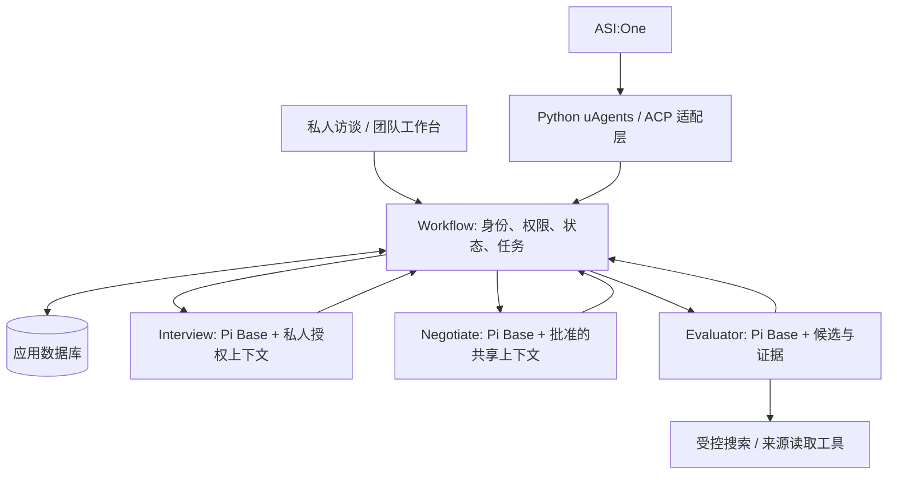
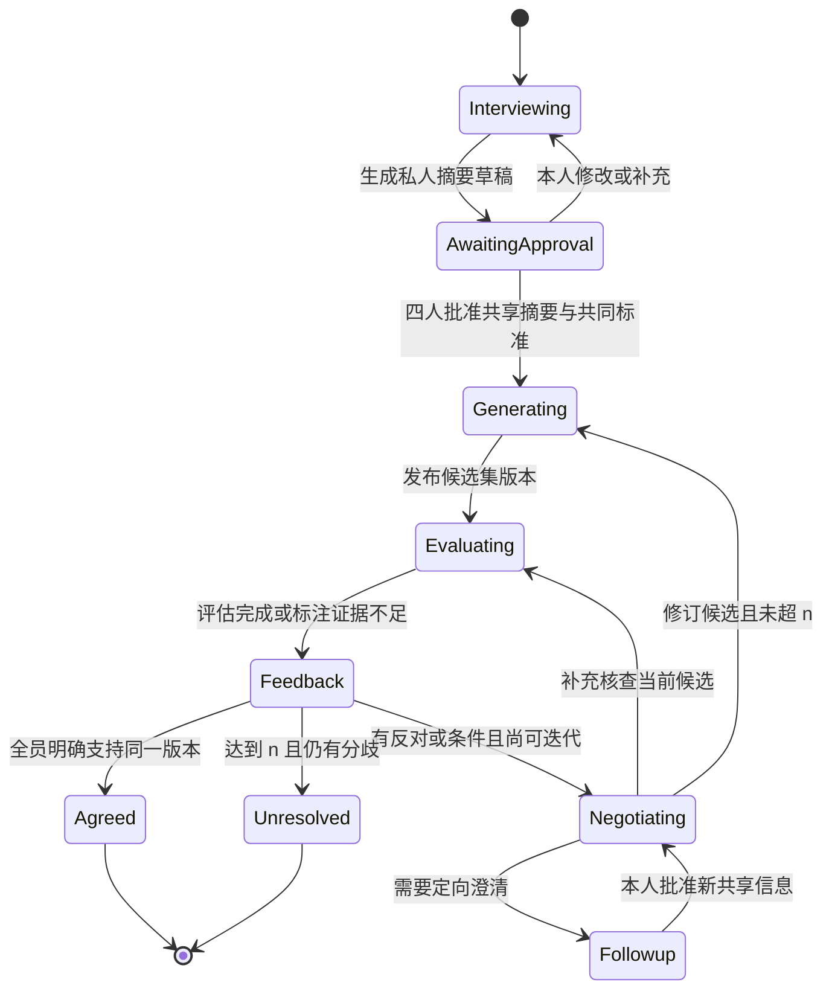

# 团队选题助手：框架与 Pi Base 设计 v0.1（旧版）

> 本文保留早期设计作迁移参考；角色拆分、流程、数据库方案和讨论轮次以 [workflow_updated.md](../workflow_updated.md) 为准。当前 Evaluator 接线见 [实现 README](evaluator/README.md)。

本文供四位开发者同步实现边界。产品保留 **Interview、Negotiate、Evaluator 三个业务 Agent**；第四位成员开发 workflow、存储、界面与通信。Pi 是三者共享的执行库，不是第四个业务 Agent。

依据：产品访谈记录、仓库产品 README，以及“了解 Fetch.ai 并搭建单 Agent”聊天（thread `01a1034d-1750-7651-a0ca-a3ccb2eac492`）。历史中的 Fetch 单 Agent 是独立教学样例；Pi 当时只是讨论方案，本次新增可复用基座。本文区分已确认需求、工程约定与尚未完成的功能。

## 1. 产品目标与最小闭环

帮助四个人从“提出一个想法就被否决”走到可以共同开展的项目。先了解每个人的真实经历、兴趣、资源和拒绝条件，再整合与核查候选；AI 有推荐权，人保留决定权。

已确认：文字优先，语音以后接入；每位成员初访最多 7 轮，每轮约 3 问；私人访谈只在本人确认摘要后共享；生成 3 个候选，展示推荐理由、类似项目和最小 demo；核查竞品与技术；主观反对也触发协商；最大迭代 n 由用户填写；18 小时开发窗口。

工程约定：初次展示候选记为迭代 1，总展示轮数不超过 n；初访不计入迭代。每位成员每次迭代最多一组 1–3 问的追访，避免一轮内无限循环。创建房间时展示这个计数口径；这些是实现建议，不冒充用户原话。

成功条件：所有人明确支持同一候选的同一版本。沉默、附条件支持、有人未参与都不是共识。到达上限时输出未解决分歧与推荐，不能自动定案。

## 2. 组件边界



这是目标结构，不表示图中的全部组件已实现。首版只需要一个后端进程管理 workflow；三个角色不必各自部署服务。Pi 运行层为 Node ESM；已有 Python/uAgents 可通过本次提供的 JSONL 子进程桥接调用，也可在 Node workflow 内直接调用。

外部 Agentverse 注册数量与三个业务角色数量不是一回事。可以先让一个外部入口调用这三个内部角色。比赛是否要求特定注册形式、实时行为与提交路径，应由 workflow 负责人对照实际赛道文件确认；本设计不宣称已经符合赛道或完成 ASI 集成。

## 3. 为什么选 Pi Core，以及 Base 提供什么

历史讨论过 Python uAgents → Pi coding-agent RPC，也讨论过 Node SDK。这里选择底层 `pi-agent-core`，便于显式提供业务工具，避免把代码编辑器的文件、shell、个人会话默认带进产品。它保留真实的模型与工具循环；模型层采用 `pi-ai`，锁定版本 1.0.1。

共用 [pi-base](pi-base/README.md) 已提供：独立操作上下文、JSON 输入输出、角色注册、强制校验函数入口、模型/工具轮数与超时限制、过滤后的进度事件、Python 子进程桥接、离线演示与测试。

**基座不替代业务实现**：完整访谈策略、三个候选生成、协商规划、检索与证据评估，需要三位负责人分别实现。工具默认空；尤其不能把未配置检索时的模型回答展示为真实查重结果。

## 4. 四人分工与交付接口

| 负责人 | 对外 operation | 负责实现 | 禁止承担 |
|---|---|---|---|
| Interview | `interview.turn` / `interview.summarize` | 初访、定向追访、覆盖度、摘要草稿；未知/拒答处理 | 读取其他成员原始访谈；自行共享摘要 |
| Negotiate | `negotiate.criteria` / `generate` / `plan` / `revise` / `recommend`（后四项也带 `negotiate.` 前缀） | 共同标准建议、三个候选、分歧分析、追访/核查计划与版本修订 | 以多数票结束；把个人偏好变硬约束；替用户同意 |
| Evaluator | `evaluator.evaluate` / `evaluator.investigate` | 相似项目、差异空间、技术条件、证据质量和未验证项 | 伪造搜索结果；宣称已验证市场需求；替团队选题 |
| Workflow | room/member/approval/feedback/task 接口 | 身份与权限、状态、版本、轮数、幂等、前端、Fetch 适配 | 作为第四个 LLM 决策 Agent |

建议业务代码放 `agent/interview/`、`agent/negotiate/`、`agent/evaluator/`，每个导出一个 definition；共用 `agent/pi-base/` 不复制三份。Base 的兼容性修改由 workflow 负责人统一维护。团队已有 `contracts.md` 与角色设计文档中的具体字段应共同遵守；不要因本基座另建一套业务模型。

每个 operation 交付：输入验证器、输出验证器、输出 schema 提示、角色提示、工具工厂、正常与异常样例。验证器同时校验原请求 ID/成员/候选版本和返回 data 的对应关系；模型输出 JSON 合法不代表业务合法。

## 5. 统一调用契约

```json
{
  "schema_version": "1.0",
  "request_id": "req-001",
  "room_id": "room-001",
  "operation": "interview.turn",
  "input_revision": 0,
  "payload": {"member_id":"member-a","mode":"initial","round_index":1,"messages":[]}
}
```

返回原封保留五个头字段，附 `status: ok|needs_input|partial|error`、`data`、`warnings`、`error`。成功时 error=null，失败时为 `{code,message,retryable}`。模型只生成业务结果，Base 补头字段。

关键规则由 workflow 实施：

1. 调用前认证成员，按 operation 构造最小上下文，不能把客户端传来的 room_id 当权限证明。
2. `request_id` 唯一并持久化去重；同 ID 不同输入拒绝。重放返回已保存结果，不再花费模型调用。
3. Interview 按该成员会话 revision 检查；其他操作按房间共享 revision 检查。不同成员的私人输入不应相互使任务失效。
4. 完成后在事务内重新检查 revision；过期结果丢弃或重新规划，不覆盖新反馈。
5. Agent 只提出结果和行动计划。共享批准、反馈、候选发布、轮数递增、最终状态均由 workflow 提交。

Base 每次 fresh session，不提供全局长期记忆。需要继续访谈时，从数据库读取该成员当前历史构造 payload；这种方式便于恢复与隔离。没有给模型直接查询全库的工具。

## 6. 端到端状态流程



图是逻辑状态，不要求页面逐一对应。定向核查不自动增加候选轮数；发布新版候选才增加。对同一候选集、同一输入版本的重复核查不无限重派：任务去重且每候选版本最多一批补充核查（建议值），仍不足则标未知回收用户反馈。用户要求停止也可以直接结束为未达共识。

任何候选修订使原支持记录失效，重新收集反馈。n=1 时只允许首轮，不生成第二版候选；仍保存反对理由并输出未达共识。缺少某人的回应停在待反馈，不能默认为赞成。

## 7. 动态协商的具体行为

用户说“不想做这个”，不要求先提供客观证明。Negotiate 用已共享信息区分可能的需求：不感兴趣、个人能力/参与条件、对受众的担忧、信息不足、对约束理解不同；这些都是待核实的假设，不能给成员贴标签。

- 原因未知：提出对该成员的追访任务，Interview 私聊 1–3 问。
- 事实有争议：提出专题核查，Evaluator 查具体证据。
- 参与条件可调整：提出缩小范围、换受众或职责调整，由用户确认后发布新版。
- 根本目标不同：保留取舍，推荐不同候选或标记无法收敛，不以“说服反对者”为目标。

Negotiate 输出计划，workflow 校验其目标成员、预算、迭代与允许动作后执行。追访原文不流入 Negotiate；成员确认的补充摘要才更新共享 revision。

## 8. 数据、隐私与工作台

建议首版 SQLite：`rooms`、`members`、`private_interviews`、`shared_profiles`、`candidate_sets`、`evaluations`、`feedback`、`tasks`、`public_events`。实现 SQL 细节由 workflow 负责人决定，但 ID、版本、来源、批准人及时间必须保留。

| 数据 | 可见范围 | 权威写入者 |
|---|---|---|
| 原始访谈/摘要草稿 | 本人与对应 Interview 调用 | workflow 私人记录 |
| 共享摘要 | 本人批准后向团队与整合开放 | workflow 的批准事件 |
| 候选/评估/推荐 | 房间成员 | workflow 验证 Agent 结果后 |
| 支持/条件/反对 | 团队看到明确共享的反馈 | 对应成员经 workflow 提交 |
| 公开进度 | 当前房间 | workflow 过滤事件后 |

工作台四块：候选卡片、来源与成员贡献、共识/分歧、当前进度。贡献引用批准摘要的 item_id；不展示私人对话或内部推理。公共反馈文本应是用户主动提供的共享内容，不能由私人追访自动摘录。

评估报告至少区分：事实来源（URL、标题、检索时间、支持哪一项）、模型推断、未知、建议下一步。没搜到只说明检索范围内没找到，不能称全球首创。搜索失败输出 partial 和待查项，不能用常识补成“已验证”。

## 9. 失败、预算与运行策略

- Base 默认每操作 60 秒 / 6 次模型轮次 / 12 次工具调用，CLI 每响应最多 4096 token；workflow 另限制房间并发、总调用、总 token 与费用预算。
- Base 不自动重试或修复。建议 workflow 对可重试基础设施错误最多重试一次；输入错误直接返回，输出不合规则交角色负责人修正或配置一次有上限的 schema 修复。
- Python bridge 70 秒硬关闭 worker；生产工具自身必须有超时和取消处理。工具限为查询与生成建议，业务写入留给 workflow。
- 本次没有实时 token→美元计费器，不能把上述限制当精确金额硬上限。正式调用前配置所用模型的预算与密钥。
- 搜索不可用时保留候选和已有评估，不把整轮流程清空。任务失败允许手动重试或结束，不把失败当成反对或同意。
- 面向房间的日志只保存事件元数据；不把 provider 错误、密钥、私人 payload 直接回显。Base 错误输出已经隐藏未知底层异常文本。

## 10. 18 小时集成顺序与验收

| 时间 | 三位角色负责人 | Workflow 负责人 |
|---|---|---|
| 0–1h | 跑通 Base demo；冻结契约与固定样例 | 冻结 revision、状态和路由 |
| 1–5h | 各自 operation、验证器、最小真实调用 | 私人访谈/摘要批准页面、持久化任务 |
| 5–9h | 三候选与真实来源评估 | 连通三角色与四块公共看板 |
| 9–13h | 追访、核查、修订 | 定向调度、去重、迭代与新版本反馈 |
| 13–16h | 修复业务边界 | Fetch/ASI 接入和端到端验证 |
| 16–18h | 联合演练 | 部署、录制、提交材料准备 |

验收故事：四人独立访谈 → 各自确认摘要 → 生成三候选 → 展示真实来源/未知项 → A 主观反对 → 只追访 A → A 批准新增条件 → 修订并重新评估 → 全员对新版确认，或达到 n 正确输出未达共识。

必须覆盖：原文不泄漏、同一请求不重复调用、旧结果不能覆盖新反馈、主观反对有效、n=1/轮数上限、搜索失败、模型超时、不同成员并发隔离。真实 ASI 入口应实际演示一个可见流程变化（例如提交回答并获得下一问），不能只展示模型聊天。

## 11. 本次交付状态与下一步

已交付：Pi Base 可运行代码、依赖锁定、初访示例、离线演示、工具循环与错误/隔离测试、Python 桥接、本文档。

未交付：三个完整业务 Agent、真实搜索工具、数据库/前端、认证、持久化幂等、硬费用上限、Agentverse 注册、ASI 端到端验证。真实模型质量、市场价值与赛道符合性也未因离线测试得到验证。

三位负责人从 Base 示例各自建立 definition；第四位先用样例连接整个闭环，再逐一替换真实调用。当前不要同时引入语音、复杂消息队列或三套独立部署，以免挤占核心协商流程的开发时间。
