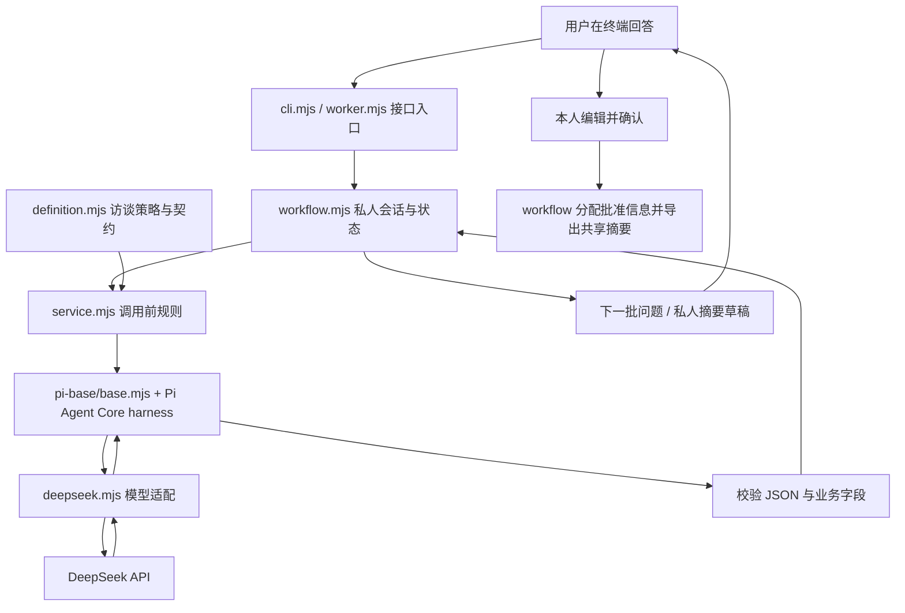

# Interview Agent 开发入口

本分支 `agent/interview` 用于单个 Interview Agent 的开发。复用团队 [Pi 基座](../pi-base/README.md)，提供初访、定向追访、摘要草稿，以及可单独运行的本地流程。产品规则见 [设计文档](../interview-agent.md)。

**新版 Workflow 对齐：** 已审阅 `feat/workflow` 的更新，详见 [接口差距与 PreferenceProfile / NegotiationBrief 设计](workflow-alignment.md)。`PreferenceProfile` 统一此前的 `full_profile` 名称；短摘要、人工 Decision gate 和讨论轮次接口仍为待实现设计。下文描述当前运行时，不能视为已接通新版团队循环。

**当前状态：46 项离线测试通过，DeepSeek 两次真实调用通过。** 真实测试覆盖首轮提问和摘要，完整多轮追问质量待人工体验。本地 workflow 只保存进程内状态，退出后清空；它是第四位成员接线的参考，团队服务的登录与数据库仍待实现。

## 自己体验真实访谈

在这台电脑的 PowerShell 中执行：

```powershell
Set-Location 'D:\AI\Hackathon\Mhacks\mhacks-product\agent\interview'
node --env-file=.env cli.mjs --live
```

本机依赖与 `.env` 已配置；看到 `DeepSeek 本地私人访谈` 就进入真实模型模式。换电脑时先运行下面的 setup，再从 `.env.example` 创建本地 `.env`，填写自己的 DeepSeek key 和模型名。

1. Agent 每批提出最多 3 个问题。在 `你的回答 >` 后输入一段文字，可以一次回答这批所有问题，按回车提交。当前输入框每次接收一行。
2. Agent 根据回答继续追问，最多 7 批；想提前看摘要，输入 `/finish`。输入 `/quit` 直接退出。
3. 摘要出现后，输入不想分享的条目序号，例如 `2,3`；直接回车保留全部条目。
4. 输入 `SHARE` 确认后，终端导出保留的共享摘要 JSON。当前导出供后续接线使用，尚未发送到团队房间；直接回车则不导出。

本机体验只使用成员 a 的私人会话，退出后会话清空。CLI 支持删除摘要条目；任意改写草稿由 `workflow.approve(..., draft)` 接口支持，完整编辑界面待团队 workflow 接入。

## 架构：一次回答如何经过系统



| 层 | 当前实现 | 具体职责 |
| --- | --- | --- |
| 交互入口 | `cli.mjs`、`worker.mjs` | CLI 给人提问；JSONL worker 给团队程序接线。默认离线，显式 `--live` 才访问模型 |
| 本地 workflow | `workflow.mjs` | 保存当前成员历史、题目、草稿、共享版本；计数、阻止重复/过期回答、等待本人批准 |
| Interview 业务 | `definition.mjs`、`service.mjs` | 定义初访与追访策略、摘要格式、输入输出校验；执行 7 批/3 问上限及空回答处理 |
| Agent harness | `pi-base/base.mjs` + `@earendil-works/pi-agent-core@1.0.1` | 为每次 operation 新建 Pi Agent，组装系统提示与授权 payload，执行模型调用，处理进度、超时、JSON 与错误 |
| 模型接入 | `deepseek.mjs` + `@earendil-works/pi-ai@1.0.1` | 发送 OpenAI 兼容 Chat Completions 请求，固定官方地址，设置 JSON 输出、关闭 thinking、禁止自动重试 |
| 调用限制 | `live-runtime.mjs` | 每进程最多 16 次调用，输入最多 48,000 字符，默认输出最多 2048 token；单次 operation 60 秒超时 |
| 离线验证 | `fixtures.mjs`、`pi-base/offline.mjs`、测试文件 | 用固定响应经过真实 Pi 运行路径，验证权限边界与程序行为 |

当前 Interview 的两个 operation 为 `interview.turn` 和 `interview.summarize`。每次实际需要模型的 operation 最多一个模型轮次；到达访谈上限、用户主动结束或没有个人回答时，相应结果可由程序直接返回。

多轮访谈历史保存在 workflow 中，每次只把当前成员所需历史传给一个新的 Pi 实例。模型不负责保存跨请求记忆；模型输出也不能写入 `approved_at`、成员 `stance` 或团队共识。

## Harness 之外的 skill、MCP、plugin 和依赖

这里的“skill”需要区分使用者。**当前访谈模型的行为来自 `definition.mjs` 的提示词与契约；开发 skill 供 Codex 修改和测试代码时使用。**

| 项目 | 当前是否接入 | 使用者与用途 |
| --- | --- | --- |
| 应用运行时 skills | 未实现独立 skill 加载器 | 初访、追访和摘要策略均定义在 `definition.mjs`，当前不会向 DeepSeek 加载 SKILL.md |
| `mhacks-interview-dev` | 本机已安装；[源文件](skill/SKILL.md) 在仓库内 | Codex 开发助手使用，约定分支、接口、离线测试与真实测试步骤 |
| Engineering skills | 已有 system-design、documentation；debug 可按需使用 | Codex 的设计、文档和诊断能力，属于开发环境 |
| 模型可调用工具 | 当前 `createTools` 返回空数组 | Interview 只根据授权输入提问与总结；没有搜索、浏览器、文件或 shell 工具 |
| MCP server | 当前 Interview 运行时未接入 | 现有访谈不需要外部数据源；团队以后确需接入工具时，可由 `createTools` 显式适配并限制权限 |
| 应用 plugin | 当前没有运行时插件依赖 | 开发环境中的 Git/文档工具不构成部署 Interview 的前置条件 |
| 模型服务 | DeepSeek 官方 API | 通过应用的服务端模型适配器访问，无需 DeepSeek MCP 或 Codex 插件 |
| 本地环境 | Node.js >=22.19.0、pnpm 11.19.0、固定 Pi 依赖 | Node 执行 ESM 模块；pnpm 根据基座 lockfile 安装依赖 |
| 配置 | `.env` 中的 `DEEPSEEK_API_KEY`、`DEEPSEEK_MODEL` | 真实运行的本地服务配置，key 文件由 Git 忽略 |

因此从仓库部署当前 Interview，必要部分是 Node、固定 Pi 依赖、业务模块、workflow 接口和 DeepSeek 配置。开发 skill 可以辅助维护，当前应用运行不依赖它。第四位成员接入团队应用时，需要补上身份认证、持久化和房间调度；其他两个 Agent 通过授权的结构化数据与它协作。

## 先跑离线流程

需要 Node.js >=22.19.0、pnpm 11.19.0。在仓库根目录执行：

```sh
pnpm --dir agent/interview setup
pnpm --dir agent/interview test
pnpm --dir agent/interview demo
pnpm --dir agent/interview chat
```

- `test`：角色契约、workflow、Pi 基座和 DeepSeek 请求格式测试，不需要 key。
- `demo`：自动演示初访 → 摘要 → 删除一条 → 本人确认 → 定向追访。
- `chat`：本地文字访谈。默认固定样例；输入 `/finish` 提前结束、`/quit` 退出。
- 所有离线结果都标注 `OFFLINE FIXTURE`，不能用来评价真实模型的访谈质量。

## 你主要改哪里

| 文件 | 用途 |
| --- | --- |
| [definition.mjs](definition.mjs) | 访谈策略、两个 operation 的提示词和输入输出验证 |
| [service.mjs](service.mjs) | `runInterview` 入口，确定性的轮数上限与无回答处理 |
| [workflow.mjs](workflow.mjs) | 本地成员会话、回答计数、版本检查、草稿确认 |
| [fixtures.mjs](fixtures.mjs) | 无 API 的固定样例 |
| [definition.test.mjs](definition.test.mjs)、[workflow.test.mjs](workflow.test.mjs) | 需要保持的业务与隐私边界 |
| [../pi-base/deepseek.mjs](../pi-base/deepseek.mjs) | DeepSeek 的 Pi 模型适配器 |
| [worker.mjs](worker.mjs) | 给团队 workflow 的 JSONL 接线入口 |

目前不提供浏览器、搜索或文件工具给 Interview 模型。竞品研究属于 Evaluator；问题目的由 Negotiate 的 `followup_task` 传入。

## 接给团队 workflow

Node 调用 `runInterview({request, runtime})`；`runtime` 由 `createDeepSeekRuntime` 或离线适配器创建。Python/uAgents 可将下面 JSON 写到 `node agent/interview/worker.mjs` 的标准输入，每行一个请求、每行一个响应。带 `--live` 才调用 DeepSeek；模型及密钥由服务端环境提供。

```json
{"schema_version":"1.0","request_id":"req-a-1","room_id":"room-1","operation":"interview.turn","input_revision":0,"payload":{"room_config":{"room_id":"room-1","member_ids":["a","b","c","d"],"initial_interview_max_rounds":7,"max_questions_per_turn":3},"private_interview":{"member_id":"a","mode":"initial","round_index":0,"messages":[],"coverage":{"pain":"unknown","idea":"unknown","skill":"unknown","resource":"unknown","preference":"unknown","objection":"unknown","participation_condition":"unknown"}},"shared_context":null,"followup_task":null}}
```

`private_interview.round_index` 明确表示 **已经回答的问答批次数**：初始为 0，第一批问题输出 1；答完第七批后停止，不生成第八批。返回停止信息时，output round_index 保持已回答数。该口径补全了设计文档中尚未明确的字段含义。

调用 `interview.summarize` 使用同样 envelope 和该成员历史，获得 `{member_id,draft_profile,changes,unknowns}`。本人可编辑 draft，应用收到确认事件后才分配 `profile_id/version/approved_at` 并共享。定向追访最多一批问题；`followup_task` 至少包含 `goal`、`expected_information`、`issue_id`，可带当前成员的上一版 `profile`。

接线负责人仍需实现：成员认证与请求投影、持久化、request_id 去重、旧回复失效检查、全团队的 n 轮限制，以及撤回共享后的刷新。这里的 session_id 只是本地索引，不是身份认证。

## DeepSeek 真实测试

已完成 2 次 `deepseek-flash` 真实调用：首轮生成 3 问，摘要保留兴趣、前端经验和后端不熟的自述，两次均通过契约校验。准备和离线验证不需要 key；真实运行从本地环境读取 key。

将本目录 [.env.example](.env.example) 复制为 `.env`，在本地填写 `DEEPSEEK_API_KEY` 和 `DEEPSEEK_MODEL`。`.env` 已被 Git 忽略；默认离线命令不会读取它。首次真实 smoke 在本目录执行：

```sh
node --env-file=.env live-smoke.mjs --live
```

脚本只做两次调用：生成首轮问题、生成一份摘要；每次最多输出 2048 token，不自动重试。检查结果后，交互式真实访谈使用：

```sh
node --env-file=.env cli.mjs --live
```

交互式每进程最多 16 次模型调用；单次上下文字符上限 48,000，调用超时 60 秒。限制是调用次数和大小，不是美元结算保证；首次真实测试前和用户确认模型及可接受的费用上限。超限或模型返回无效结果时保留错误，不自动切模型或反复付费重试。

当前官方文档列出 `deepseek-flash` 和 `deepseek-v4-pro`。示例选前者，模型名可以更改；每次开展真实测试时核对当前可用型号。本适配采用官方 Chat Completions、JSON 输出和关闭 thinking 的文字访谈配置。来源：[首次调用](https://api-docs.deepseek.com/)、[JSON Output](https://api-docs.deepseek.com/guides/json_mode/)、[Thinking Mode](https://api-docs.deepseek.com/guides/thinking_mode/)。

真实 smoke 成功仅证明连接和结构化接口可用；仍需人工评估追问是否自然、是否重复、摘要是否保留主观反对、是否将“想学”误写成已掌握能力。

完整开发步骤和技能/工具安排见 [DEVELOPMENT.md](DEVELOPMENT.md)。
