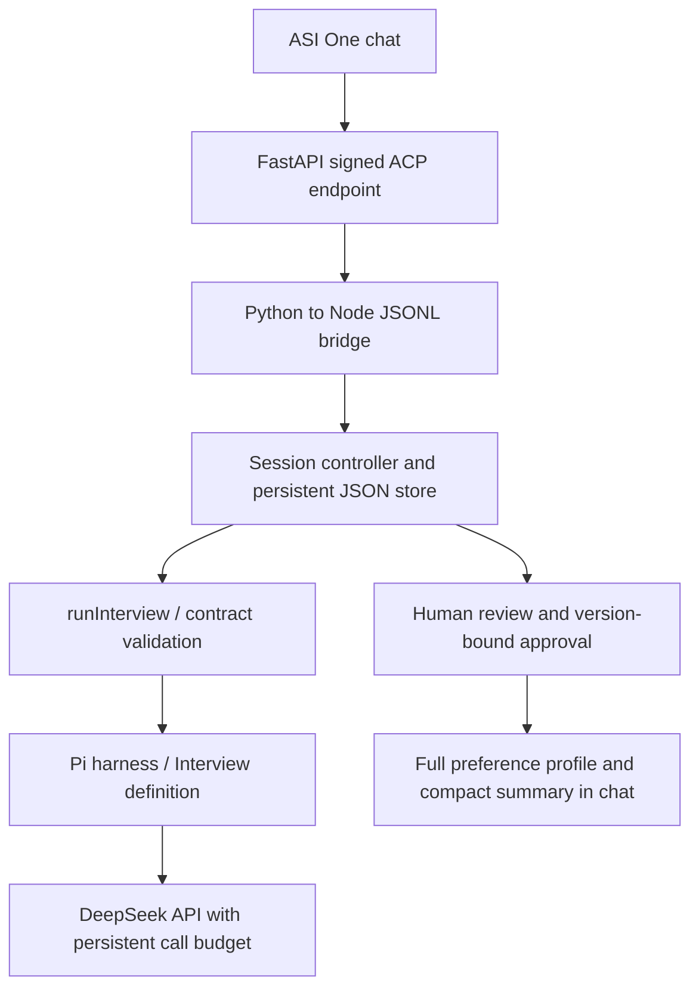

# Considea Interview — standalone Agentverse adapter

**Status (2026-10-03): implemented and tested offline. Not yet verified as registered, discoverable, or usable in ASI:One. No hackathon submission has been confirmed.** The project is Considea, with a four-person team; this entry exposes only the Interview Agent.

This adapter reuses `runInterview` and the v2.1 contract. It adds a persistent individual workflow and the official Agent Chat Protocol (ACP 0.3.0) transport. Existing legacy CLI behavior is unchanged.

## Architecture and actual dependencies



| Component | Implementation |
| --- | --- |
| Harness | Existing Pi core, via `../service.mjs` |
| Interview behavior | Prompts and validation in `../definition.mjs` |
| Workflow actions | `session.mjs`: persistence, profile updates, edits, approval, export, idempotency |
| Public protocol | `app.py`: FastAPI + `uagents-core`; signed envelopes and ACK handling |
| Runtime plugin / MCP | None required or installed for this adapter |
| Development skill | Local `mhacks-interview-dev`; helps development, not a deployment dependency |
| Model | DeepSeek `deepseek-flash`; no ASI model key required by this backend |
| Registration | Agentverse API key, stable private agent seed, reachable HTTPS endpoint |

Actions are deterministic workflow code, not arbitrary tools offered to the model. The model can propose questions and draft profile content; it cannot approve sharing or execute shell commands.

## Local setup and offline tests

From the repository root, use Node >=22.19, pnpm 11.19, and Python 3.12:

```sh
pnpm --dir agent/interview setup
python -m venv .interview-local/agentverse-venv
# Activate the virtual environment using your platform's normal command.
python -m pip install -r agent/interview/agentverse/requirements.txt
pnpm --dir agent/interview test
python -m unittest discover -s agent/interview/agentverse -p test_transport.py
python agent/interview/agentverse/init_config.py
python agent/interview/agentverse/app.py --config .interview-local/agentverse-config.json
```

On Windows the virtual-environment interpreter is `.interview-local/agentverse-venv/Scripts/python.exe`. If Node is not on PATH, set `CONSIDEA_NODE` to its executable's absolute path. The default listener is `127.0.0.1:8011`; `/status` identifies the mode and address. `/chat` requires a correctly signed ACP envelope, so a plain JSON chat request is intentionally rejected.

For a JSONL-only offline run, start `node agent/interview/agentverse/worker.mjs` and send one JSON object per line:

```json
{"sender":"offline-demo","session_id":"demo-1","msg_id":"m1","text":"start"}
```

Keep sender and session unchanged for the conversation, and give each new message a unique `msg_id`. Replies are explicitly marked `OFFLINE MOCK`. These fixtures prove workflow behavior, not model quality. A direct JSONL caller is trusted local code; public callers must use the signed HTTP transport.

## State, outputs, and limits

- An empty profile exists on the first session request, before questions run. Each answered batch updates the detailed profile; previous versions are retained locally.
- The default limit is five answered batches; `CONSIDEA_MAX_BATCHES` accepts 1–7. First questions cost one model call. Each non-final answered batch costs two (profile update and next questions); the final batch costs one. Five full batches can therefore require ten calls. `/finish` uses no model call if a profile has already been saved.
- `/finish` enters review. `/edit`, `/drop` and `/short` invalidate the previous approved export. Approval requires the current review revision and token. `/export` retrieves the result without calling the model.
- `preference_profile` retains all approved items; `preference_summary` selects at most eight items of at most 80 characters. IDs allow omitted items to be retrieved from the full artifact. Oversized critical conditions block summary readiness.
- Session identity uses **verified envelope sender plus session UUID**. It does not prove a human identity or support multi-member room authorization. ASI's actual sender/session behavior still needs end-to-end verification.
- The local JSON store is single-process only. Run one server/worker against a state directory. No cross-process locking or automatic retention/deletion policy is provided.
- A session accepts at most 120 distinct message IDs, each message at most 16,000 characters. Public envelopes are limited to 100KB and eight pending requests. Duplicate message IDs replay the saved result instead of repeating model work.
- An operation failure preserves the previous committed session state. A successful summary followed by a failed next-question call rolls back that turn; model-call reservations remain consumed. `/profile` shows the last committed state.
- This adapter currently runs initial interviews only. The reusable service's team `followup` / `reopened` inputs remain available through the separate [integration contract](../followup-integration.md), not ASI chat commands.

The export names are adapter artifacts; the team workflow must map these to its contracts and implement authorized profile queries. Do not claim the standalone adapter has connected Negotiate or Evaluator.

## Live mode and finite budget

Put `DEEPSEEK_API_KEY` and `DEEPSEEK_MODEL=deepseek-flash` in `agent/interview/.env`. Keep it, the seed and all state under ignored paths. `init_config.py` creates `.interview-local/agentverse-config.json` once and never overwrites its identity. After obtaining a live-call allowance, edit the local config to set `live: true`, `max_calls` and `max_usd`. Restart the server after changing config. There is no network model call at startup.

For an approved four-call, US$0.10 test, use `max_calls: 4` and `max_usd: 0.10`. This is enough for start → one answered batch → `/finish` → approve/export, with at most three calls if the model continues to the second batch. It is not enough for a full five-batch interview.

`budget.mjs` reserves US$0.025 before each request, persistently, with no refund or automatic retry on uncertainty. It pins `deepseek-flash`, thinking off, <=48KB serialized request, <=32 messages and <=2048 output tokens. The reservation uses peak pricing verified on 2026-10-03 ($0.30/M input, $1.20/M output), a byte-based input bound and a 16K-token framing allowance. This is a conservative application allowance, not a provider billing report; recheck [official pricing](https://api-docs.deepseek.com/quick_start/pricing/) before later runs. Do not delete/change the budget ledger or switch state directories to bypass an exhausted allowance. Public traffic shares the same allowance.

## Registration and submission

1. Test live mode locally within the approved allowance. Keep the local seed stable; it determines the address.
2. Expose port 8011 through a stable HTTPS deployment, or a temporary tunnel for a supervised demo (`cloudflared tunnel --url http://localhost:8011`). A quick tunnel ends when its process stops and its URL changes on restart.
3. Set `AGENTVERSE_API_KEY` locally, then run:

```sh
python agent/interview/agentverse/register.py --config .interview-local/agentverse-config.json --endpoint https://YOUR-ACTUAL-HOST/chat
```

4. Confirm the returned Agentverse profile, test discovery and the entire interview/review/export inside ASI:One, then record the address/profile URL and shared ASI chat link here and in the root README. Registration success alone does not prove discovery or chat operation. Endpoint reachability and platform registration expiry may require renewal; unattended operation is not implemented.
5. Submit the four-person Considea project through Devpost and the MHacks Submission Agent. Reuse an existing Submission Team ID if available. `Considea` is the project name, not a verified platform Team ID. Lead name/email and teammates' joins are still required; do not create a solo team for a single-agent entry.

Public listing text and required badges are in [AGENT_README.md](AGENT_README.md). Agent address, Agentverse URL, shared ASI chat URL, Submission Team ID and Devpost URL: **not confirmed yet**.

References: [official hackpack](https://www.fetch.ai/events/hackathons/mhacks-2026/hackpack), [official FastAPI registration guide](https://docs.agentverse.ai/documentation/launch-agents/agentverse-sdk/fast-api), [submission walkthrough](https://docs.google.com/document/d/1UDW-X1C24hxZviFOQzjTeh0pXRNAoflMb8lhJqZP9Z0).
