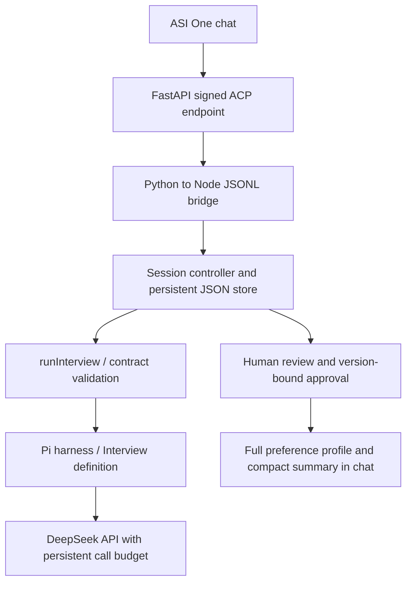

# Considea Interview — standalone Agentverse adapter

**Current verification:** five answered batches, review and synthetic export completed through the local controller using real DeepSeek (17 full items, 8 brief items), with two failed attempts/retries. ASI connectivity remained unavailable; this is NOT a clean ASI end-to-end pass. Duplicate temporary item keys now receive unique local keys without changing facts/evidence; malformed JSON remains rejected. 75 Node tests and 5 Python tests passed. Run budget: 12 calls; cumulative 52/52 and US$1.30 reserved, not billing. Service/tunnel stopped and Agentverse inactive confirmed. [Full synthetic Q&A and limitations](verification-2026-10-04.md). Older snapshots below are historical.

**Final bounded repair verification (2026-10-04):** Nested string-array `data.warnings` is moved to root before unchanged strict validation; malformed warnings and invalid evidence remain rejected. A validated answer/profile is now persisted before requesting the next questions. If that request fails, `/next` explicitly retries only questions, `/finish` reviews saved facts, and redelivery does not repeat model calls or count the answer twice. 74 Node tests and 5 Python tests passed. The exact saved fourth-answer failure replay now passes offline (17 items). The final one authorized DeepSeek summary call passed (14 items), but semantic category errors remain: privacy participation conditions were labeled `problem`, and teammate uncertainty was labeled `participation_condition`. It was an isolated summary verification, not an approved profile update or a clean five-round ASI run. Total ledger: 40/40 calls, US$1/US$1 reserved, not actual billing. Public service and tunnel remain stopped. No claim of all bugs resolved or production readiness.


**Latest retest (2026-10-04): service and public tunnel are STOPPED.** ASI session `318f3fa8-f71c-4d03-b560-91c0854106f4` completed three answered batches, early finish, synthetic review/approval and export (15 full-profile items, 8 brief items). This is NOT a clean five-round pass: startup initially failed because the worker/budget code rejected the newly authorized 40-call/US$1 cap; both guards now accept that bounded allowance, with a ledger-retention/exhaustion regression test. A subsequent question used private message IDs as shared source IDs; prompts now explicitly separate those namespaces, without weakening validation. Two answered batches passed after that prompt change, then the fourth answer failed because the model nested warnings inside data. That formatting issue remains unresolved. Offline: 72 Node tests passed. Cumulative ledger: 39/40 calls, US**Latest retest (2026-10-04): clean five-round acceptance is still NOT passed.** A new ASI session (`08fa2190-ff8e-46f7-8fa6-43e24340fbb3`) completed three answered batches and saved v3. The fourth batch failed. Protected diagnostics identified (1) object-valued `unknowns` instead of strings, now normalized with field/source checks and a regression test; (2) a subsequent output citing an assistant question as evidence, correctly rejected and still unresolved. No source check was removed. Latest offline count: 71 Node tests, with the prior five Python tests unchanged. This new run consumed 10 of the additional 12 authorized calls. The cumulative ledger is 26/28 calls and US$0.65/US$0.70 reserved, leaving two calls. Dollar reservations are not billed usage. Older success/budget snapshots below are historical..975/US$1 reserved (not billed usage); this run used 11 calls. Port 8011 and the temporary tunnel were stopped after testing; the Agentverse registration remains. Restart requires a new reachable tunnel endpoint and registration update. Historical snapshots below are retained and do not describe current deployment or allowance.

**Status (2026-10-04): registered on Agentverse (Active / ASI Available). An ASI conversation completed two answered batches, early finish, review, deletion, version-bound approval and JSON export, using a clearly labeled synthetic participant. The final export contains nine full-profile items and eight summary items. 70 Node tests and five Python transport/bridge tests passed. General search discovery and competition submission are not yet verified.** Considea is one multi-agent project with Interview, Negotiate and Evaluator agents and a four-person team. This is the first component being registered, not a separate single-agent project or team submission.

[Test conversation, requires access to the account](https://asi1.ai/chat/3b6d579b-177b-416b-8414-c8e1182c10a8). This is not a public shared-chat submission link. The conversation retains failed diagnostic attempts before the successful flow; it is not evidence that all requests succeeded. The five-batch ceiling was not reached in this live test. Model field classification and repetitive questions still need improvement: for example, an unknown feature was incorrectly classified as a constraint and removed during review.

Budget snapshot: the original four-call allowance plus an explicitly approved additional 12 calls gives a cumulative cap of 16 calls / US$0.40. All sixteen calls have now been reserved: the later clean-session test used two calls and failed output validation; a final isolated summary verification used the last call successfully. No further live model calls are authorized. The additional test used nine calls, including diagnosis of invalid JSON structure/status. These are application reservations, not measured provider charges. The same persistent ledger remains in use.

- Agent name: **Considea Interview**
- Agent address: `agent1qvn23uk8egw36xpzl7k3nyw0tk7yvadtwqstqn3ch4yrh23hu7qhxhjvdzc`
- [Agentverse profile](https://agentverse.ai/agents/details/agent1qvn23uk8egw36xpzl7k3nyw0tk7yvadtwqstqn3ch4yrh23hu7qhxhjvdzc/profile)
- [ASI:One entry](https://asi1.ai/ai/agent1qvn23uk8egw36xpzl7k3nyw0tk7yvadtwqstqn3ch4yrh23hu7qhxhjvdzc)

The current endpoint uses a temporary tunnel on the developer's computer. Availability requires both the server and tunnel to remain running; this is not a permanent deployment. `/help` and `/profile` do not need model calls. When the remaining budget is exhausted, obtain renewed authorization and increase the cumulative allowance; do not reset the ledger. The chat now explicitly reports exhausted model allowance instead of a generic operation failure.

An earlier live sample changed an 18-hour deadline to 17 hours in an inferred goal and extended lack of skill into a preference. Prompts now forbid these transformations; the later ASI sample correctly retained the 18-hour limit, willingness to learn, and subjective participation condition. This is a single development example, not a reliability estimate. Contract validity does not establish factual accuracy; synthetic approval in a test is not a real member's approval.

Live debugging also exposed missing `data` wrappers and inconsistent `status` values. The harness's final instructions now reinforce the root `{status,data,warnings}` object and operation-specific status; the Interview operations now perform explicitly reported local normalization of known transport-only defects (missing data wrapper, redundant status, string-array notes moved to warnings), followed by unchanged strict schema and evidence validation. Unknown fields, fabricated approvals, foreign IDs/evidence, invalid categories, malformed JSON and partial results remain rejected. No model retry or fabricated personal content is used. Optional `CONSIDEA_TRACE_MODEL=1` records the latest model output only in the private local store for diagnosis. It is off by default and was disabled after this test; never use that output as public progress or commit it.

This adapter reuses `runInterview` and the v2.1 contract. It adds a persistent individual workflow and the official Agent Chat Protocol (ACP 0.3.0) transport. Existing legacy CLI behavior is unchanged.

Latest repair verification: the failed clean-session answer was reconstructed in an isolated `interview.summarize` request using the same personal text and conversation context. One DeepSeek call returned a valid 12-item draft with the 18-hour limit, skills and participation condition intact. This did not mutate or approve the ASI session. Full clean ASI end-to-end verification of this final code remains outstanding because the authorized allowance is exhausted. Offline tests reproduce the earlier flattened/notes and wrong-status failures and verify that normalization cannot admit fabricated approvals or foreign evidence. `INVALID_OUTPUT` now gives a specific user-facing explanation rather than suggesting the user entered a bad command.

## Architecture and actual dependencies



| Component | Implementation |
| --- | --- |
| Harness | Existing Pi core, via `../service.mjs` |
| Interview behavior | Prompts and validation in `../definition.mjs` |
| Workflow actions | `session.mjs`: persistence, profile updates, edits, approval, export, idempotency |
| Public protocol | `app.py`: FastAPI + `uagents-core`; signed envelopes and ACK handling |
| Runtime plugin / MCP | None required or installed for this adapter |
| Development skill | Local `mhacks-interview-dev`; helps development, not a deployment dependency |
| Model | DeepSeek `deepseek-flash`; no ASI model key required by this backend |
| Registration | Agentverse API key, stable private agent seed, reachable HTTPS endpoint |

Actions are deterministic workflow code, not arbitrary tools offered to the model. The model can propose questions and draft profile content; it cannot approve sharing or execute shell commands.

## Local setup and offline tests

From the repository root, use Node >=22.19, pnpm 11.19, and Python 3.12:

```sh
pnpm --dir agent/interview setup
python -m venv .interview-local/agentverse-venv
# Activate the virtual environment using your platform's normal command.
python -m pip install -r agent/interview/agentverse/requirements.txt
pnpm --dir agent/interview test
python -m unittest discover -s agent/interview/agentverse -p test_transport.py
python agent/interview/agentverse/init_config.py
python agent/interview/agentverse/app.py --config .interview-local/agentverse-config.json
```

On Windows the virtual-environment interpreter is `.interview-local/agentverse-venv/Scripts/python.exe`. If Node is not on PATH, set `CONSIDEA_NODE` to its executable's absolute path. The default listener is `127.0.0.1:8011`; `/status` identifies the mode and address. `/chat` requires a correctly signed ACP envelope, so a plain JSON chat request is intentionally rejected.

For a JSONL-only offline run, start `node agent/interview/agentverse/worker.mjs` and send one JSON object per line:

```json
{"sender":"offline-demo","session_id":"demo-1","msg_id":"m1","text":"start"}
```

Keep sender and session unchanged for the conversation, and give each new message a unique `msg_id`. Replies are explicitly marked `OFFLINE MOCK`. These fixtures prove workflow behavior, not model quality. A direct JSONL caller is trusted local code; public callers must use the signed HTTP transport.

## State, outputs, and limits

- An empty profile exists on the first session request, before questions run. Each answered batch updates the detailed profile; previous versions are retained locally.
- The default limit is five answered batches; `CONSIDEA_MAX_BATCHES` accepts 1–7. First questions cost one model call. Each non-final answered batch costs two (profile update and next questions); the final batch costs one. Five full batches can therefore require ten calls. `/finish` uses no model call if a profile has already been saved.
- `/finish` enters review. `/edit`, `/drop` and `/short` invalidate the previous approved export. Approval requires the current review revision and token. `/export` retrieves the result without calling the model.
- `preference_profile` retains all approved items; `preference_summary` selects at most eight items of at most 80 characters. IDs allow omitted items to be retrieved from the full artifact. Oversized critical conditions block summary readiness.
- Session identity uses **verified envelope sender plus session UUID**. It does not prove a human identity or support multi-member room authorization. ASI's actual sender/session behavior still needs end-to-end verification.
- The local JSON store is single-process only. Run one server/worker against a state directory. No cross-process locking or automatic retention/deletion policy is provided.
- A session accepts at most 120 distinct message IDs, each message at most 16,000 characters. Public envelopes are limited to 100KB and eight pending requests. Duplicate message IDs replay the saved result instead of repeating model work.
- An operation failure preserves the previous committed session state. A successful summary followed by a failed next-question call rolls back that turn; model-call reservations remain consumed. `/profile` shows the last committed state.
- This adapter currently runs initial interviews only. The reusable service's team `followup` / `reopened` inputs remain available through the separate [integration contract](../followup-integration.md), not ASI chat commands.

The export names are adapter artifacts; the team workflow must map these to its contracts and implement authorized profile queries. Do not claim the standalone adapter has connected Negotiate or Evaluator.

## Live mode and finite budget

Put `DEEPSEEK_API_KEY` and `DEEPSEEK_MODEL=deepseek-flash` in `agent/interview/.env`. Keep it, the seed and all state under ignored paths. `init_config.py` creates `.interview-local/agentverse-config.json` once and never overwrites its identity. After obtaining a live-call allowance, edit the local config to set `live: true`, `max_calls` and `max_usd`. Restart the server after changing config. There is no network model call at startup.

For an approved four-call, US$0.10 test, use `max_calls: 4` and `max_usd: 0.10`. This is enough for start → one answered batch → `/finish` → approve/export, with at most three calls if the model continues to the second batch. It is not enough for a full five-batch interview.

`budget.mjs` reserves US$0.025 before each request, persistently, with no refund or automatic retry on uncertainty. It pins `deepseek-flash`, thinking off, <=48KB serialized request, <=32 messages and <=2048 output tokens. The reservation uses peak pricing verified on 2026-10-03 ($0.30/M input, $1.20/M output), a byte-based input bound and a 16K-token framing allowance. This is a conservative application allowance, not a provider billing report; recheck [official pricing](https://api-docs.deepseek.com/quick_start/pricing/) before later runs. Do not delete/change the budget ledger or switch state directories to bypass an exhausted allowance. Public traffic shares the same allowance.

## Registration and submission

1. Test live mode locally within the approved allowance. Keep the local seed stable; it determines the address.
2. Expose port 8011 through a stable HTTPS deployment, or a temporary tunnel for a supervised demo (`cloudflared tunnel --url http://localhost:8011`). A quick tunnel ends when its process stops and its URL changes on restart.
3. Set `AGENTVERSE_API_KEY` locally, then run:

```sh
python agent/interview/agentverse/register.py --config .interview-local/agentverse-config.json --endpoint https://YOUR-ACTUAL-HOST/chat
```

Alternatively, append `--key-file .interview-local/agentverse-api-key.txt` to read the Agentverse key from a private, ignored file containing only the key. The registration wizard calls the same credential `AGENTVERSE_KEY`; this script uses `AGENTVERSE_API_KEY` unless a key file is supplied. Never commit either credential.

4. Confirm the returned Agentverse profile, test discovery and the entire interview/review/export inside ASI:One, then record the address/profile URL and shared ASI chat link here and in the root README. Registration success alone does not prove discovery or chat operation. Endpoint reachability and platform registration expiry may require renewal; unattended operation is not implemented.
5. Register Negotiate and Evaluator as additional components as they become ready. Keep all three under the same four-person **Considea MAS project**. Collect their individual addresses, Agentverse profile URLs and ASI demo links in one project submission through Devpost and the MHacks Submission Agent. If a Considea submission already exists, update it using its existing Submission Team ID; do not create a second project for Interview. `Considea` is the project name, not a verified platform Team ID. Lead name/email and teammates' joins are still required for the team submission.

Public listing text and required badges are in [AGENT_README.md](AGENT_README.md). Registration/profile links are listed above. Shared ASI demo chat URL, Submission Team ID and Devpost URL: **not confirmed yet**. Individual Agentverse registration is complete; the Considea MAS competition submission is a separate step.

References: [official hackpack](https://www.fetch.ai/events/hackathons/mhacks-2026/hackpack), [official FastAPI registration guide](https://docs.agentverse.ai/documentation/launch-agents/agentverse-sdk/fast-api), [submission walkthrough](https://docs.google.com/document/d/1UDW-X1C24hxZviFOQzjTeh0pXRNAoflMb8lhJqZP9Z0).
