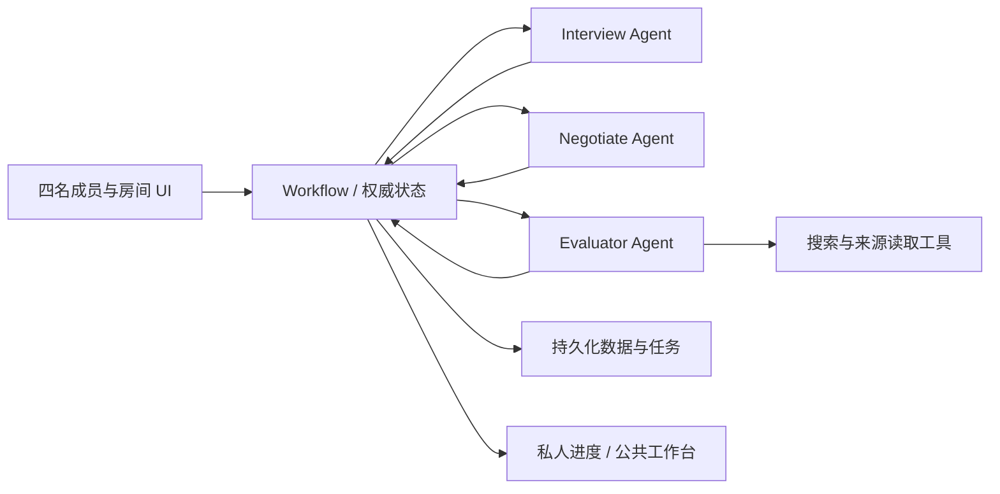

# Workflow 设计与第四位成员的实现任务（旧版）

> 本文保留早期候选迭代设计作迁移参考；新版先讨论再生成候选，状态机与对象以 [workflow_updated.md](../workflow_updated.md) 为准。Evaluator 的 needs_input 时间追问与 Evaluation 1.2 接线见 [实现 README](evaluator/README.md)。

负责人：成员 4。目标：把三个 Agent 的结果接成用户能完成的流程，管理真实状态、共享权限、版本和停止条件。

Workflow 使用普通应用代码实现。它根据程序规则执行 Negotiate 的行动提案，不作为第四个 LLM Agent。Agent 业务判断与数据结构见 [目录说明](README.md) 和 [contracts.md](contracts.md)。

## 1. 组件与连接

四人的私人初访可以同时进行。候选生成要等共享输入准备好；评估三个候选可并发。存在 depends_on 的协商任务依序执行。不要让 Agent 之间未经检查地互相发起调用或共享原始对话。

## 2. 首版状态机

| 房间状态 | 动作与转移 |
| --- | --- |
| `setup` | 设置成员、比赛约束和 n，发起初访 |
| `interviewing` | 收集四人回答；每人独立计数 |
| `awaiting_profiles` | 等待所有成员确认共享摘要；拒答字段可未知 |
| `awaiting_criteria` | Negotiate 提议标准，团队确认共同项并保留分歧 |
| `generating` | 调用 Negotiate 生成三个候选，分配第 1 轮/版本 |
| `evaluating` | Evaluator 评估，允许 complete 或明确 partial |
| `collecting_feedback` | 展示带报告的当前候选，等待成员态度 |
| `planning_negotiation` | Negotiate 分析分歧，提出动作 |
| `following_up` | 追访/专题评估任务；等待回答及共享批准 |
| `awaiting_revision_approval` | 团队确认方向或范围变化；拒绝则保留当前候选 |
| `revising` | Negotiate 输出新版，workflow 验证并发布下一轮 |
| `consensus` | 全员对同一个当前版本明确 support |
| `unresolved` | 达到 n 上限或无可推进的信息，保留推荐与分歧 |
| `ended_by_team` | 团队主动结束并保存当前成果 |

状态名是首版建议。界面可合并等待状态，但数据库不能把“等待摘要批准”和“已有共享信息”混为一谈。四人未回复或未批准时停留等待，不自动猜测。

团队标准无法完全一致时，允许成员确认“这些共同项正确，其他偏好仍不同”，保留争议继续生成不同取舍的候选。某硬约束仍 disputed 时不得标为全队确认。

## 3. 调用主流程

1. 创建 RoomConfig，校验 n 为正整数。页面说明首次候选轮次计入 n。
2. 对四人分别创建 PrivateInterview；调用 interview.turn，等待成员每组回答，再继续或 summarize。每人最多 7 组初访问题。
3. 成员编辑摘要并点击共享；应用写入 approved_at 和版本。全部批准后继续。
4. 调用 negotiate.criteria，收集团队对标准的确认和分歧。
5. 调用 negotiate.generate；验证候选数量、来源和内容结构。给候选分配稳定 ID、version=1、iteration_index=1。
6. 每候选调用 evaluator.evaluate；报告与版本绑定。失败按 partial 展示，不阻塞成无限等待。
7. 收集对当前版本的反馈。候选可以全部 undecided，不能自动选择排名第一。
8. 若全员 support 同一个候选且当前报告已展示，进入 consensus；如报告更新揭示新条件，要求重新确认后再结束。
9. 若有反对/条件/未知且 iteration_index < n，调用 negotiate.plan，校验并分派允许动作。
10. 追访批准和专题评估完成后，再调用 plan 或 revise。重复 plan 不可绕过本轮追访/工具预算。
11. 发布修订方案之前校验所需确认、版本和 n；成功发布才递增轮数，然后评估变更并重新收集反馈。
12. 到 n 上限仍没有共识，调用 negotiate.recommend，保存 unresolved；停止新增选题轮次。

支持直接在候选反馈 UI 中更新 stance。Interview 的回答或 Negotiate 的推测都不能代替用户点击确认。

## 4. 行动调度规则

| Action | Workflow 行为 |
| --- | --- |
| `interview_followup` | 指定成员收到私人题目；调用 Interview，等其回答和摘要批准 |
| `evaluate_question` | 调用 Evaluator.investigate；检验来源、版本与预算 |
| `propose_revision` | 形成修订任务；需要方向/范围确认时先等团队 |
| `request_feedback` | 在 UI 请求当前版本反馈，不发送未授权的外部消息 |
| `propose_direction_change` | 展示提案，获得团队确认后才允许发布新方向 |
| `report_unresolved` | 显示仍未解决的问题，可结束或由团队接手 |

为每个 task 保存 task_id、request_id、operation、输入版本、依赖、visibility、状态和结果。状态建议为 queued/running/awaiting_member/awaiting_share/awaiting_team/done/failed/cancelled。

校验 member_id 属于房间、candidate_version 仍适用、来源已批准、动作枚举有效、depends_on 无循环、预算尚可。若 Agent 把反对者不存在的名字当目标，拒绝该提案并返回结构化错误。

“任务 done”应在业务信息可用时成立。私人回答未批准共享时不能视为可供另一个成员或 Agent 使用。若成员结束追访但不分享，task 可以结束且结果为 no_shared_update，依赖方只得到这个状态。

## 5. 轮数、版本与防重复

- 四人初访 round_index 独立计数，不占用候选轮数。
- 初次候选展示 iteration_index=1；每发布一批修订候选才 +1。失败、重试和未获批准草稿不增加轮数。
- 每人每选题轮次最多一组追访是工程建议，最多 3 问；由数据库计数，不由提示词自行记忆。
- n=1 时仍可收集当前反馈并给出推荐，但不能进入第二轮或无限追访。
- 用户调整 n 必须明确操作并记录，不接受 Agent 自行扩大额度。
- 同 request_id 的结果最多应用一次；重复网络提交不会创建两套候选或重复消耗轮数。
- 同方向修订增加 candidate.version；新方向新 ID；当前批次绑定 iteration_index。
- 任何新版需要重新反馈。旧版本记录显示为历史，不计入新版共识。

成员修改共享摘要后，标记依赖它的候选分析需要刷新；不继续使用失效授权。若修改了关键条件，应经修订和重新反馈，不能保持旧的“已达成共识”。

## 6. 权限与状态校验

数据库和请求投影在服务端隔离私人信息，不能只靠 UI 隐藏。成员认证方式可简化为房间内独立身份令牌，但不能让用户通过传别人的 member_id 访问其访谈。

LLM 无权写入：approved_at、实际 stance、用户确认记录、权威轮数、最终 consensus。所有更新通过用户事件或校验后的程序逻辑执行。

建议将公共状态与私人会话分别存储；模型日志默认不出现在公共看板。公共展示的“为什么追问”只能使用共享信息，不能泄露私人答案。

## 7. 三个页面与应用事件

以下是 UI / 应用事件建议，不锁定框架或路由：

| 页面 | 用户事件 |
| --- | --- |
| 房间入口 | create_room、join_room、set_constraints、set_max_iterations |
| 私人访谈 | submit_answer_batch、finish_interview、edit_profile_draft、approve_profile |
| 团队工作台 | confirm_criteria、submit_feedback、confirm_revision、end_session |

团队工作台四部分直接使用模块结果：候选卡片（Negotiate+Evaluator）、来源关系（contributions）、共识/分歧（真实 feedback+open_issues）、工作进度（task events）。来源首版用可展开列表即可。

实现统一调用适配器 `invoke_agent(operation, request)`，提供每个 operation 的固定样例。这样三位负责人可独立完成业务逻辑，第四位不必等待所有真实模型接口。

## 8. 存储与运行建议

18 小时首版建议选团队熟悉的一套后端、一个持久化数据库、简单任务表和轮询。必须能区分成员、摘要版本、候选版本、报告、反馈和 task；进程重启后不能丢失批准或重复执行已经完成的任务。

可用 SDK 的 Agent 注册或通信作为适配层，但状态机仍由程序控制。Fetch.ai 的具体赛事接入要求待官方规则核实，不把“用了三角色提示词”自动称为符合赛道。

配置模型、搜索、工具调用的明确上限和超时。具体运行费用上限尚未指定，应在启用实际付费调用前填写配置；不能把18小时开发时间视为无限调用预算。

## 9. 失败恢复

| 情况 | 应用处理 |
| --- | --- |
| 模型 JSON 无效 | 最多一次格式修复；仍失败保留任务错误，不推进状态 |
| 搜索失败 | 展示 partial 与真实错误，允许成员在知道未知项的情况下继续 |
| 用户晚回复 | 接受仍有效的任务回答；已替换的候选先标历史，再生成适用的新任务 |
| 并发修改 | 对成员会话/共享快照分别检查 revision，过期结果不覆盖新输入 |
| 服务重启 | 恢复持久化任务与等待状态；去重已应用结果 |
| 成员一直未回答 | 标 waiting，允许团队主动结束，不自动同意或编造其摘要 |
| 修改提案未被批准 | 保留草稿及分歧，不发布新版，不自动用完 n |

只对短暂工具错误进行有上限的重试。模拟数据须在工作台显式标记 demo/mock，不冒充真实研究结果。

## 10. 联合验收

1. 四个独立身份分别访谈、编辑摘要和批准共享，能看到三个候选及报告。
2. 在私人答案中放入不共享的独特句子，检查公共候选、来源、分歧、事件均不出现它。
3. 三人同意一人主观反对，系统追访或提出替代，绝不进入 consensus。
4. 有条件支持与 missing 均不能变成 support。
5. 修改候选后旧反馈不计入新版本共识；旧报告晚到不能覆盖新报告。
6. n=1 与 n=2 分别运行，实际发布轮数不超限，结束状态准确。
7. 重复提交同一个请求，不能生成重复任务或多扣一轮。
8. 搜索失败显示 partial；全部明确支持当前版才可进入 consensus。
9. 进程重启后等待共享批准的任务仍等待，不重新执行或公开原文。

测试这些权限、轮数和版本边界是必要的；文案和简单布局通过手动查看即可。完成标准是一个可运行的完整选题与一次协商循环，并能正确演示未达共识的结束路径。
