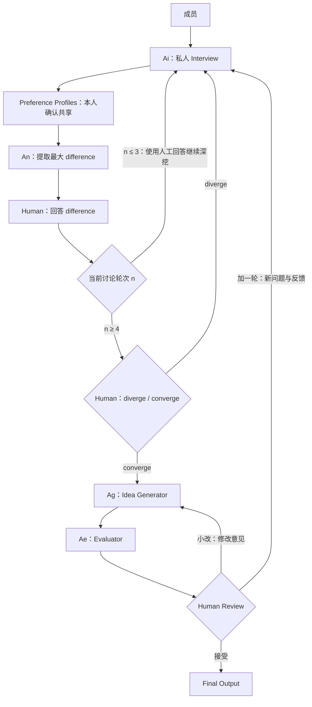

# Workflow 设计：人工引导的讨论与候选迭代

> 本文是白板及后续问答确认后的流程说明，是 README 和 agent/workflow.md 的流程依据。它描述目标行为与实现建议；本次仅更新文档和系统图，暂不实现 workflow。尚未确认的规则集中列在文末，不由模型补成团队决定。


## 1. 组件与职责

| 组件 | 输入与职责 | 输出 |
| --- | --- | --- |
| Participants / Human | 私人访谈、分歧回答、收敛判断、候选审阅 | 真实成员输入与决策事件 |
| Interview Agent（Ai） | 对应成员的私人上下文、获准共享的分歧与人工回答 | 深入问题、Preference Profile 草稿 |
| Negotiator Agent（An） | 获准共享的 Profiles 和讨论轨迹 | 当前最重要的 difference、证据与可回答的问题 |
| Idea Generator（Ag） | 获准共享的完整讨论历史；修订时包括人工修改意见 | 有讨论来源与取舍的候选或修订版本 |
| Evaluator Agent（Ae） | 当前候选版本、必要约束与检索来源 | 可行性、技术条件、相似项目、风险和未知项 |
| Workflow / 应用层 | 校验角色输出与真实用户事件 | 权威状态、任务、权限、轮次和版本 |

Workflow 使用普通应用代码实现，负责调度四个业务 Agent。图中的 Agent 连线表示业务信息流，实际调用与权限检查均经过 Workflow。LLM 不直接修改批准记录、成员回答、收敛决定或最终确认。

## 2. 已确认的主流程



### 讨论阶段

1. 成员分别接受 Interview，形成个人偏好画像。
2. 本人确认共享后，Negotiator 比较 Profiles，提出当前最大 difference。
3. 相关成员亲自回答该 difference；回答可以是二元选择或开放文本。
4. 当 `n ≤ 3`，把人工回答交回 Interview，深入访谈并更新 Profiles，再进入下一轮分歧识别与人工回答。
5. 当 `n ≥ 4`，在人工回答后，由 Human 决定 `diverge` 或 `converge`。
6. `diverge` 返回 Interview，继续上述讨论循环；`converge` 才进入 Idea Generator。

**任何一轮都不允许 Negotiator 绕过 Human 直接返回 Interview。** 前三轮用于充分澄清分歧；达到第 4 轮只开放人工收敛选择，不自动生成，也不自动结束。之后继续讨论仍须有人回答新的 difference。

### 生成与审阅阶段

1. Idea Generator 基于获准共享的讨论历史生成候选。
2. Evaluator 对当前候选进行评估。
3. Human 查看候选与评估，然后选择：

| Human Review 动作 | 路径 | 需要带回的内容 |
| --- | --- | --- |
| 接受 | 输出 Final Output | 被接受的候选及版本、对应评估、真实确认 |
| 小改 | Idea Generator → Evaluator → Human Review | 修改意见、当前候选版本及相关评估 |
| 加一轮 | Interview → Profile → Negotiator → Human → 轮次与收敛节点 | 未解决问题、人工反馈、候选与评估中相关的新信息 |

小改不启动完整访谈，修订后仍需重新评估和审阅。加一轮重新进入讨论路径，不能直接从访谈跳到生成。这里没有“生成后先人工微调再首次评估”的独立阶段。

## 3. Preference Profile 与共享边界

Interview 的初访覆盖真实问题、目标用户、兴趣、已有想法、技能与资源、期望体验、限制和比赛目标。成员没有现成 idea 也可以提供信息。

画像包含以下内容维度。实际 JSON 使用契约中的 items/category 结构；下表用于解释内容，不另定义一套并行字段：

| 字段 | 含义 |
| --- | --- |
| `problems` | 想解决的问题与痛点 |
| `target_users` | 倾向关注的用户群体 |
| `interests` | 兴趣与偏好 |
| `skills` | 技术、领域知识与资源 |
| `desired_experience` | 希望产品提供的体验 |
| `constraints` | 不能接受的条件 |
| `tradeoffs` | 可以交换或妥协的部分 |
| `goals` | 比赛与项目目标 |
| `confidence` | 对总结的置信描述，不等于真实成员认可 |
| `evidence` | 支持条目的对应回答引用 |

画像草稿由本人修改、删除和确认。成员可以区分“我的陈述”和“AI 的推断”；Agent 不能自行写入共享批准。

原始回答的引用保留私人访问边界。公共来源只能指向获准共享的内容，不能通过 evidence、候选理由或“为什么追问”间接公开原文。画像撤回或更新后，新任务不得继续传播失效授权，依赖结果需标记待刷新。

## 4. difference 的定义

沿用此前 workflow 的含义：**当前团队最值得优先解决、会实质影响最终方向的偏好或约束分歧。**

比较维度包括：

- 用户群体与痛点优先级；
- 产品形态和已有 idea 的方向；
- 技术路线；
- 对创新与实用性的重视程度；
- 可接受的开发复杂度；
- 风险容忍与成员参与条件。

“最大”综合考虑对最终方向的影响、受影响成员、信息是否不足、不解决是否阻碍方案形成，以及不同选择是否导向不同产品路径。不单纯按意见不同的人数排序。

二元问题可以是“我们是否愿意将主要用户限定为大学生”；开放问题可以是“AI 应该替用户做什么，哪些决定必须由用户保留”。二元选项也不能阻止成员说明“这个问题没有准确表达我的分歧”。

建议输出：

```json
{
  "type": "binary",
  "question": "我们是否愿意将主要目标用户限定为大学生？",
  "why_it_matters": "用户选择会改变后续产品方向。",
  "affected_members": ["member_1", "member_2"],
  "supporting_preferences": [],
  "conflicting_preferences": [],
  "decision_options": ["是", "否"]
}
```

开放问题使用 `type: "open"`，保留问题、重要性、受影响成员和来源。条目必须引用真实获准共享的内容，不能为了凑讨论轮数捏造分歧。

## 5. Human 回答与收敛判断

这是两个分别记录的人工事件：

| 人工事件 | 发生时机 | 含义 |
| --- | --- | --- |
| Answer Difference | 每轮 Negotiator 提出 difference 后 | 成员说明自身选择、原因、条件或对问题的纠正 |
| Diverge / Converge | `n ≥ 4` 且本轮所需人工回答已收到后 | 人决定继续讨论或进入候选生成 |

Workflow 保存真实答案、成员身份、关联分歧及时间戳。未回复、超时、模型推测均不能替代回答。不同人的相反答案应原样保留，不自动合成一个虚构的“共同决定”。

Agent 可以解释差异是否减少，但 `stable`、分歧评分或任何模型标签都不能触发进入生成。Human 作出 converge 决定才可放行。多人决定如何形成团队动作尚未确定，见第 12 节。

供人参考的收敛迹象沿用原设计：关键用户和核心问题基本明确，价值主张不再大幅漂移，剩余差异主要是实现细节或可以用候选取舍表达。这里不要求所有偏好完全相同，也不以“分歧必须清零”作为已确认规则。

## 6. 轮数与深挖

`n` 在图中表示团队讨论轮次，采用 `n ≤ 3` 和 `n ≥ 4` 两个分支。前三轮必须包含 Human 对 difference 的回答；从第 4 轮起由 Human 选择是否收敛。

需要分别维护的计数是：

| 计数 | 用途 |
| --- | --- |
| 团队讨论轮次 `n` | 决定是否开放人工 diverge/converge 选择 |
| 私人访谈问答次数 | 限制单次讨论内的问题量 |
| Pi 模型 / tool turns | 限制一次 Agent 调用的执行预算 |
| 候选版本 | 追踪生成、人工修改与重新评估 |

现有初访示例中的“最多 7 轮”和 Base 的模型 turn 限额均不能直接解释成团队讨论轮数。失败重试、重复提交和小改候选不应冒充新一轮人工讨论；精确编号与递增事务在实现前确定。

回到 Interview 时，传入当前画像、本轮 difference、人工回答、已问过的问题和仍未解释清楚的原因。问题逐步从“你想解决什么”走向“为什么”“什么条件会改变判断”“在约束下愿意牺牲什么”。本人继续确认新增共享信息。

本次确认没有设置团队讨论的硬上限，也没有确认超限后的自动动作。运行预算、人工停止和超时应独立设计，不能以预算耗尽为由伪造 converge 或接受。

## 7. Idea Generator、Evaluator 与最终结果

### Idea Generator

读取获准共享的完整讨论轨迹：历轮画像、difference、真实回答、新增解释、保留和放弃的偏好、人工收敛选择、比赛背景与约束。

候选数量沿用 **3–5 个的建议值**，仍待确认。候选字段建议包括 `title`、`target_user`、`problem`、`solution`、`why_team`、`discussion_trace`、`key_tradeoffs`、`mvp` 和 `open_questions`。各候选应有真实不同的取舍。

小改时输入人工意见、当前候选与评估，输出新版本；保留旧版本和修改理由。修改不自动继承旧确认。

### Evaluator

候选生成或修订后，先评估再交给 Human Review。检查技术 API、数据、设备、时间内完成 MVP 的条件、相似公开项目、重合点与具体差异。

结论区分：

- `supported_by_source`：有实际来源支持；
- `team_claim`：成员自述；
- `needs_test`：仍需实际测试；
- `unknown`：信息不足；
- `verified`：仅在存在可追溯的实际验证记录时使用，不能只凭文档或模型判断。

首版仍以只读检索和文档核查为主，不承诺自动运行原型。每条结论保留来源、支持范围和限制。搜索失败可输出 `partial`，明确未知项后交给人审阅；Evaluator 不替人选小改、加一轮或接受。

### Final Output

Human 接受当前候选后，输出方案、候选演化、关键偏好、人工决定、技术与相似项目来源、已知风险及未解决问题。

进入生成时的 converge 和最终方案的接受是不同事件。最终确认绑定当前候选版本及实际展示的评估；后续修改需要重新评估、重新确认。多人接受的汇总规则尚未确定，不能默认等于全员共识。

## 8. 状态机建议（未实现）

状态名用于后续接线，不代表当前仓库已有对应代码。

| 状态 | 下一步与条件 |
| --- | --- |
| `setup` | 建立成员身份、比赛背景和约束 |
| `interviewing` | 私人回答与画像草稿 |
| `awaiting_profile_approval` | 等待本人批准共享 |
| `detecting_difference` | Negotiator 使用获准共享的输入 |
| `awaiting_difference_answers` | 等待所需真实人工回答，未齐时保持等待 |
| `routing_round` | `n ≤ 3` 回访；`n ≥ 4` 等待人工收敛选择 |
| `awaiting_convergence_decision` | diverge 回访；converge 生成 |
| `idea_generating` | 生成或依据人工小改修订候选 |
| `evaluating` | 评估当前版本，成功或明确 partial 后进入审阅 |
| `awaiting_review` | 接受则输出；小改回生成；加一轮回访 |
| `completed` | 保存人工接受的方案、评估与剩余风险 |

等待人工回答、等待共享批准和等待收敛选择必须能够区分。失败不触发成功转移。人工停止、预算中断和恢复状态需要单独定义；不能把它们自动转换成 completed。

## 9. 数据、权限与任务

六个 Agent operation、精确字段和人工事件接口已统一到 [contracts.md](agent/contracts.md)，机器可读定义见 [JSON Schema](agent/interfaces/protocol.schema.json)，配对请求/返回见 [fixtures](agent/interfaces/fixtures)。下表说明概念对象，不作为另一套字段定义。

| 对象 | 建议保存的内容 |
| --- | --- |
| Room | 成员、比赛背景、约束、当前阶段和团队讨论轮次 |
| PrivateInterview | 成员、私人问题与答案、会话 revision、画像草稿 |
| ApprovedProfile | 成员批准的条目、版本、批准事件及来源 |
| Difference | 所属讨论、问题类型、重要性、相关成员与获准共享的证据 |
| DifferenceAnswer | 成员、分歧、原始人工回答与时间戳 |
| ConvergenceDecision | 所属讨论、真实人工 diverge/converge 记录 |
| DiscussionRound | 输入画像版本、分歧、人工回答、追问与共享更新 |
| IdeaCandidate | ID、版本、内容、讨论来源与修改轨迹 |
| Evaluation | 候选版本、证据、发现、风险、未知项与 complete/partial |
| HumanReview | 候选和报告版本、接受/小改/加一轮、人工意见与身份 |
| Task | request_id、operation、输入 revision、依赖、可见性、状态与结果 |

Agent 调用的上下文由 Workflow 按权限构造。Interview 只能看到对应成员的私人信息；其他角色使用获准共享的必要信息。

`approved_at`、真实回答、收敛选择、审阅动作和最终确认来自用户事件；轮次、候选版本和任务状态由程序校验后写入。模型不生成权威批准事件。

保留原有工程约束：持久化请求去重；同 ID 不同输入拒绝；回包提交前检查 revision；旧结果不覆盖新回答或新版；不同成员的私人会话分别检查版本；公共进度仅展示允许共享的信息。

## 10. 页面与失败恢复

目标页面为 Room、Private Interview、Team Workbench 和 Final Idea。Team Workbench 展示共享偏好、当前 difference、人工回答、收敛选择与讨论历史。Final Idea 展示当前候选、评估和三种 Human Review 动作。

模型输出不合法、搜索失败、成员未回答、共享未批准、服务重启和并发更新均需有明确等待或错误状态。部分评估可以交给人审阅；任务失败不得增加讨论轮数、补全人工答案或跳过必需节点。模拟来源和示例数据必须标明。

技术框架、数据库、搜索服务和运行预算仍待实现时选定。现有 Pi Base 可以作为单次调用适配层，不能代替上述应用状态机。

## 11. 后续联合验收

以下为未来实现的验收要求，本次没有实现或执行这些业务测试。

1. 私人访谈隔离；未批准内容不进入 Profiles 的共享投影、候选、来源或进度。
2. Negotiator 支持二元和开放 difference，并引用获准共享的证据。
3. 每轮先收到所需真实人工回答，才允许后续路由；没有 An → Ai 的跳过 Human 路径。
4. 分别验证 `n = 1、2、3` 的回访路径，不进入生成。
5. `n = 4` 时停在人工收敛选择；diverge 回 Interview，converge 进入 Idea Generator。
6. `n > 4` 继续遵守相同人工门槛，不按固定最大轮次自动生成。
7. 下一轮问题使用前轮人工回答，不重复浅层问卷，不编造成员选择。
8. 生成后严格进入 Evaluator，再进入 Human Review。
9. 小改回 Idea Generator，产生新版本、重新评估、重新审阅。
10. 加一轮回 Interview，保留相关人工反馈与证据，并重新经过 An 和 Human。
11. 接受只输出被人工接受的当前候选版本；旧确认与旧报告不能覆盖新版本。
12. partial 评估展示未知项；重复请求、旧回包和重启不跳过人工节点。

## 12. 尚待确认的实现细节

已确认主干可据此更新文档；以下内容没有在白板问答中定案：

- 多个成员对 diverge/converge 或审阅动作意见不一致时如何汇总；谁有提交团队动作的权限。
- discussion_round 的初始化、精确递增事件，以及“加一轮”后的编号是否延续。任何选择都须保持图中的前三轮回访与 `n ≥ 4` 人工门槛。
- 每轮向所有成员还是受影响成员提问；所需人工答案的集合如何确定。
- 没有实质分歧时，接口以 kind=clarification 表达待人工核实的问题，仍经过 Human 回答；成员纠正问题后的具体交互由 Workflow 确定，不伪造 difference。
- 每轮私人问答数量、总运行预算、超时、主动停止与恢复规则。
- 候选数量、哪些候选送评估、多人小改的冲突处理以及接受某一候选的具体交互。
- 四个 Agent 的负责人、持久化和前端技术选型。operation/schema 已由接口契约 v2.0 明确，后续变更需同步契约、schema 和样例。

旧文档里的“3–5 轮自动结束”“Negotiate 生成候选”“候选先微调再评估”和“n 表示候选展示上限”已被本文流程替代。当前角色契约已更新到 v2.0，现有业务运行代码未在本次调整。Workflow 可先用离线样例接线；这些样例不是业务实现或真实模型效果证明。