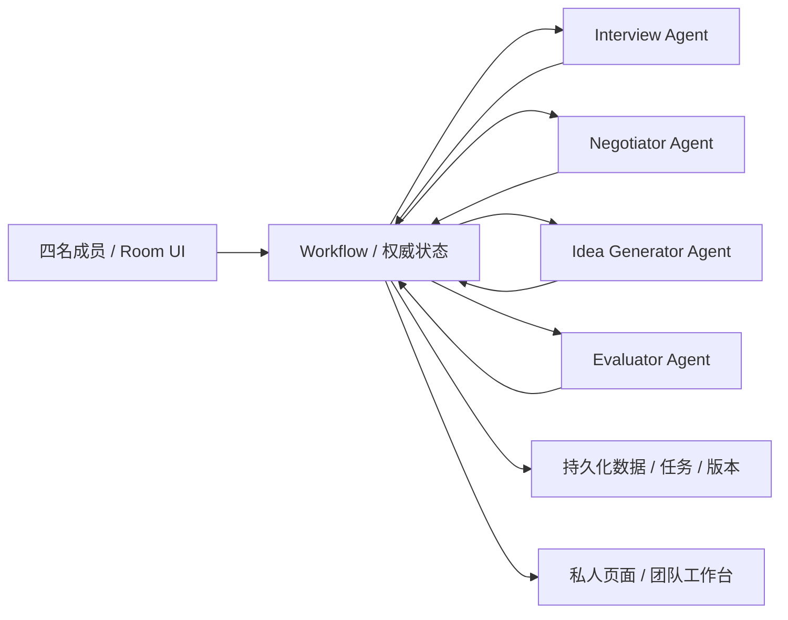
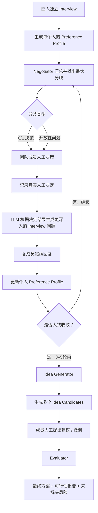

# Workflow 设计

负责人：Workflow / 应用层。目标：把多个 Agent 的结果接成一个真实可执行的团队决策流程，管理成员身份、私人访谈、共享摘要、人工决策、轮次、版本、权限、任务状态和最终确认。

新的核心流程不是“先生成候选，再不断修改候选”，而是先通过多轮 **Interview → Preference Profile → Divergence Detection → Human Decision → Deeper Interview** 逐步逼近团队共同理解，再由 **Idea Generator** 基于整个讨论过程生成候选方案，最后由 **Evaluator** 做可行性与相似项目验证。

Workflow 使用普通应用代码实现。它根据程序规则执行 Agent 的行动提案，不作为额外的 LLM Agent。Agent 的判断必须通过结构化输入输出进入 Workflow；LLM 不能直接修改权威状态。

---

## 1. 系统组件与连接



### 核心循环



### 设计原则

1. **AI 负责发现问题和组织讨论，不负责替成员作最终价值判断。**
2. **每一轮的人工决策都是真实用户事件，不能由模型预测或补全。**
3. **Interview 应该越来越深，而不是重复问“你喜欢什么”。**
4. **Idea Generator 必须使用整个讨论历史，而不是只看最后一轮摘要。**
5. **Evaluator 放在候选产生以后，避免过早用“可行性”压制还没有成形的团队想法。**
6. **任何私人回答在被本人批准共享之前，都不能进入公共团队上下文。**

---

## 2. 首版状态机

| 房间状态 | 动作与转移 |
| --- | --- |
| `setup` | 设置成员、比赛背景、硬约束和讨论轮数 |
| `interview_round_0` | 四名成员分别进行初始 Interview |
| `profile_confirmation` | 每个人确认自己的 Preference Profile 是否准确 |
| `detecting_divergence` | Negotiator 汇总所有已授权 Profile，识别最大分歧 |
| `awaiting_decision` | 将分歧转成 0/1 或开放性人工决策题 |
| `decision_recorded` | 所有相关成员完成真实人工选择 |
| `generating_followup` | LLM 根据决策结果生成更深入的问题 |
| `interview_round_n` | 成员回答本轮深挖问题并确认新增共享信息 |
| `checking_convergence` | 判断讨论是否已经大致收敛，或是否需要下一轮 |
| `idea_generating` | Idea Generator 基于完整讨论历史生成多个候选 |
| `candidate_refinement` | 成员对候选进行人工建议、删改和方向微调 |
| `evaluating` | Evaluator 做可行性、相似项目和技术条件检查 |
| `final_review` | 团队查看最终方案、证据和剩余风险 |
| `completed` | 团队确认最终结果 |
| `unresolved` | 达到最大讨论轮数仍存在关键分歧，保存讨论成果并停止 |

> 建议讨论轮数设置为 `3–5`，其中首轮为基础 Interview，后续轮次均由前一轮人工决策动态生成问题。首版可以默认 `4` 轮。

---

## 3. 调用主流程

### 3.1 创建 Room

创建 `RoomConfig`：

- 团队成员数量；
- Hackathon 背景、主题或赛道；
- 已知硬约束；
- 目标用户 / 场景（如果团队已经有）；
- discussion rounds，范围建议为 `3–5`；
- 最多生成多少个 Idea Candidates；
- 是否允许外部搜索，以及调用预算。

创建完成后，每个成员获得独立身份。

---

### 3.2 Round 0：独立 Interview

四名成员并行进入自己的私人 Interview。

首轮问题主要覆盖：

- 我最近真正遇到的生活 / 学习 / 工作问题是什么；
- 哪些问题让我最想解决；
- 我最想做什么、最不想做什么；
- 我有什么技术、经验、资源或数据；
- 我希望这次 Hackathon 得到什么；
- 我对“有趣、实用、创新、技术挑战、比赛表现”等目标分别重视什么；
- 有没有已有 idea，以及什么部分最想保留。

首轮的目标不是让模型直接生成产品，而是建立每个人自己的 **Preference Profile**。

---

### 3.3 生成 Preference Profile

Interview Agent 根据个人回答生成一个结构化的个人画像。

建议结构：

| 字段 | 含义 |
| --- | --- |
| `problems` | 想解决的问题 / 痛点 |
| `target_users` | 倾向关注的用户群体 |
| `interests` | 兴趣与偏好 |
| `skills` | 技术、领域知识、资源 |
| `desired_experience` | 希望产品给用户带来的体验 |
| `constraints` | 不愿接受的限制 |
| `tradeoffs` | 可以妥协、可以交换的部分 |
| `goals` | 对比赛 / 项目的主要目标 |
| `confidence` | Agent 对这一条总结的置信程度 |
| `evidence` | 来自哪些原始回答 |

Profile 必须由本人确认。

成员可以：

- 修改措辞；
- 删除不准确内容；
- 标记“这是我说过的”；
- 标记“这是 AI 推断的，我不同意”。

只有确认后的字段才能进入团队共享上下文。

---

## 4. Negotiator：从 Preference Profile 中找“最大分歧”

初始 Profile 准备完成后，进入 Negotiator。

Negotiator 不直接生成 idea，而是回答：

> **“现在团队最应该先解决的分歧是什么？”**

它需要比较成员之间的：

- 用户群体偏好；
- 痛点优先级；
- 产品形态；
- 技术路线；
- 对创新与实用性的重视程度；
- 可接受的开发复杂度；
- 对风险的容忍度；
- 已有 idea 的方向。

### 4.1 分歧输出格式

建议：

```json
{
  "type": "binary",
  "question": "我们是否愿意把主要目标用户限定为大学生？",
  "why_it_matters": "不同成员对目标用户的选择会直接改变后续产品方向。",
  "affected_members": ["member_1", "member_2", "member_3"],
  "supporting_preferences": [],
  "conflicting_preferences": [],
  "decision_options": ["是", "否"]
}
```

开放问题则使用：

```json
{
  "type": "open",
  "question": "什么样的 AI 参与方式才能在帮助用户的同时保留用户自己的决策权？",
  "why_it_matters": "成员对 AI 应该自动执行多少工作存在明显差异。",
  "affected_members": ["member_1", "member_2", "member_4"]
}
```

### 4.2 “最大分歧”的含义

不要简单按照“有多少人意见不同”排序。

可以综合：

- 对最终方向的影响；
- 有多少成员被影响；
- 当前信息是否不足；
- 如果不解决该分歧，后续是否很难形成方案；
- 不同选择会不会产生完全不同的产品路径。

因此一个两人之间的关键方向分歧，可能比四个人对一个次要功能的分歧更重要。

---

## 5. 人工决策 Gate

这是整个 Workflow 的关键人工节点。

Negotiator 只能提出：

> “这是当前最重要的分歧。”

不能直接决定：

> “所以团队应该选 A。”

Workflow 将其转换成成员可以真正回答的问题。

### 5.1 0/1 决策

例如：

> “我们是否愿意把目标用户限定为大学生？”

- Yes
- No

### 5.2 开放性决策

例如：

> “如果必须在创新性与实现难度之间做取舍，你更愿意牺牲哪一边？”

或：

> “你认为 AI 在这个产品里最应该替用户做什么、最不应该替用户做什么？”

### 5.3 决策规则

- 相关成员必须亲自回答；
- `missing`、超时、未回复不等于支持；
- Agent 不得代替成员补答案；
- Workflow 保存原始决策和时间戳；
- 成员可以看到这是一个由 AI 挑出的“关键分歧”，但不必接受 AI 对分歧的解释；
- 所有重要方向变化都通过真实用户事件确认。

---

## 6. 根据人工决定生成更深入的 Interview

人工决策完成后，Negotiator / Interview Agent 根据：

1. 原始 Preference Profile；
2. 当前最大分歧；
3. 所有成员刚刚做出的决定；
4. 前几轮已经问过的问题；
5. 仍然没有解释清楚的原因；

生成下一轮 Interview。

### 6.1 “越来越深”的原则

后续问题不应该继续停留在：

> “你喜欢什么？”

而应该进入：

> “为什么？”

再进入：

> “什么条件会让你的判断发生变化？”

最后进入：

> “在明确约束下，你愿意牺牲什么？”

例如：

**Round 0：**
> “你最想解决的生活问题是什么？”

**Round 1：**
> “为什么这个问题对你来说比其他问题更值得解决？”

**Round 2：**
> “如果解决它必须牺牲 50% 的自动化程度，你还愿意做吗？为什么？”

**Round 3：**
> “如果团队已经决定采用这个方向，你认为最不能妥协的用户体验是什么？”

这样每一轮是在解释和验证前一轮的判断，而不是重新做一次浅层问卷。

---

## 7. 迭代与收敛

每一轮完整流程：

```text
已有 Preference Profiles
        ↓
Negotiator 找最大分歧
        ↓
人工回答关键决策问题
        ↓
生成更深入的 Interview
        ↓
成员回答并确认共享内容
        ↓
更新 Preference Profiles
        ↓
检查是否大致收敛
```

### 7.1 收敛不等于“所有人完全相同”

建议把收敛定义为：

- 关键用户群体已经基本一致；
- 核心问题基本一致；
- 产品价值主张不再发生大幅漂移；
- 剩余差异主要属于实现细节或可在候选方案中解决的 trade-off；
- 连续一轮没有新的高影响分歧产生。

### 7.2 不自动宣布共识

系统可以标记：

- `high_divergence`
- `medium_divergence`
- `low_divergence`
- `stable`

但最终的团队选择仍由成员完成。

首版可以用简单规则：

- 最少完成 3 轮；
- 最多 5 轮；
- 第 3 轮后如果已经 `stable`，允许提前结束；
- 第 5 轮结束时无论是否完全一致，都进入 Idea Generation；
- 如果仍存在关键分歧，在最终结果中显式展示，不伪造“全员一致”。

---

## 8. Idea Generator Agent

当团队经过 3–5 轮讨论、关键分歧已经明显减少后，才进入 Idea Generation。

Idea Generator 的输入不是一张最终摘要，而是：

- 每个成员最终 Preference Profile；
- 每轮分歧；
- 每个分歧对应的人工决定；
- 每轮新增的解释；
- 哪些偏好被保留；
- 哪些偏好被放弃或妥协；
- 团队最终共同方向；
- Hackathon 的背景与约束。

因此它生成的不是“AI 突然想到的 idea”，而是：

> **从整个团队协商轨迹中合成出来的候选方案。**

### 8.1 Candidate 数量

首版建议生成 `3–5` 个候选。

每个候选应包含：

| 字段 | 内容 |
| --- | --- |
| `title` | 简洁名称 |
| `target_user` | 具体用户群体 |
| `problem` | 解决的核心问题 |
| `solution` | 核心产品机制 |
| `why_team` | 为什么适合这个团队 |
| `discussion_trace` | 来自哪些讨论与决定 |
| `key_tradeoffs` | 为了形成该方案牺牲了什么 |
| `mvp` | Hackathon 最小 Demo |
| `open_questions` | 仍然未知的部分 |

候选之间必须有真正不同的 trade-off，而不是只换名字。

---

## 9. Candidate Refinement：成员人工微调

Idea Generator 生成候选后，不直接进入 Evaluator。

先让成员逐个看候选，并提出：

- 保留；
- 删除；
- 合并；
- 修改目标用户；
- 修改功能；
- 修改 AI 的参与程度；
- 缩小 / 扩大 MVP；
- 增加限制条件。

### 9.1 Refinement 的原则

成员此时不需要再次经历完整 Interview。

这一阶段是：

> **“已经产生一个具体 idea，我希望把它改成更像我们真正愿意做的东西。”**

Workflow 为每个修改保存版本：

```text
Idea v1
  ↓
Member Suggestions
  ↓
Idea v2
  ↓
Member Confirmation
```

旧版本保留为历史记录，不能让旧版的支持状态自动迁移到新版。

---

## 10. Evaluator Agent

只有在候选经过成员微调后，才进入 Evaluator。

Evaluator 负责验证：

### 10.1 可行性

- 技术 API 是否存在；
- 数据是否可以获得；
- 是否有关键设备依赖；
- 时间内是否能做出 MVP；
- 是否存在明显的技术阻塞。

### 10.2 相似项目检查

- 是否存在高度相似的公开项目；
- 重合点在哪里；
- 我们具体差异在哪里；
- 哪些说法有公开来源支持。


### 10.3 风险

Evaluator 将结论分成：

- `verified`
- `supported_by_source`
- `team_claim`
- `needs_test`
- `unknown`

避免把 Agent 推测写成事实。

---

## 11. Final Output

最终输出由：

1. 当前选中的 Idea；
2. Candidate 演化过程；
3. 成员最终的关键偏好；
4. 团队已经做出的关键人工决定；
5. Evaluator 的可行性结论；
6. 相似项目与差异；
7. 当前已知风险；
8. 仍未解决的问题；

组成。

建议最终展示：

### Final Idea

> 一句话解释产品是什么。

### Why This Team

> 为什么这个方案和本团队的兴趣、能力、限制匹配。

### What We Decided

> 哪些关键问题经过真实成员决策。

### Why It Is Feasible

> Evaluator 验证了什么，还有什么未知。

### Remaining Risks

> 不能被 AI 假装解决的问题。

---

## 12. Action 调度规则

| Action | Workflow 行为 |
| --- | --- |
| `start_interview` | 为指定成员创建私人 Interview session |
| `generate_profile` | 根据已完成回答生成 Preference Profile 草稿 |
| `approve_profile` | 保存本人确认的共享 Profile |
| `detect_divergence` | Negotiator 分析共享 Profiles，输出最大分歧 |
| `request_decision` | 向成员展示人工决策题 |
| `record_decision` | 保存成员真实选择，不允许 LLM 代填 |
| `generate_followup` | 根据当前决策生成更深入的问题 |
| `start_next_round` | 开启下一轮 Interview |
| `check_convergence` | 计算讨论状态，不直接宣布共识 |
| `generate_ideas` | Idea Generator 生成 3–5 个候选 |
| `refine_candidate` | 成员提交修改意见并产生新版本 |
| `evaluate_candidate` | Evaluator 做可行性、技术和相似项目检查 |
| `finalize` | 团队确认最终方案 |
| `report_unresolved` | 输出仍未解决的问题并允许团队接手 |

每个 task 保存：

- `task_id`
- `request_id`
- `operation`
- `input_version`
- `depends_on`
- `visibility`
- `status`
- `result`
- `created_at`
- `completed_at`

建议状态：

```text
queued
running
awaiting_member
awaiting_share
awaiting_team
done
failed
cancelled
```

---

## 13. 权限与状态校验

### 13.1 LLM 不允许直接写入

以下字段必须由应用逻辑控制：

- `approved_at`
- `decision`
- `actual_stance`
- `round_index`
- `candidate.version`
- `final_status`
- `consensus`
- `member confirmation`

### 13.2 私人信息隔离

数据库层面将：

```text
Private Interview
Private Profile Draft
Approved Shared Profile
Team Discussion
```

分开存储。

Agent 可以看到其被授权的数据，但不能通过：

- 公共候选；
- 来源标签；
- “为什么追问”；
- 状态事件；

间接泄露未授权的私人回答。

### 13.3 版本规则

任何候选修改都会产生新版本：

```text
candidate_A_v1
candidate_A_v2
candidate_A_v3
```

新版本必须重新收集相关成员的确认。

旧版：

- 可以展示为历史；
- 不计入新版共识；
- 旧报告不能覆盖新版；
- 旧支持状态不能自动继承。

---

## 14. 建议的数据对象

### Room

```text
room_id
members[]
hackathon_context
constraints[]
discussion_round_limit
idea_candidate_limit
status
```

### PrivateInterview

```text
member_id
round_index
questions[]
answers[]
profile_draft
profile_version
approved_at
```

### Divergence

```text
divergence_id
round_index
type
question
why_it_matters
affected_members[]
evidence[]
status
```

### Decision

```text
decision_id
divergence_id
member_id
answer
timestamp
```

### DiscussionRound

```text
round_index
input_profiles
divergence
decisions[]
followup_questions[]
profile_updates[]
convergence_status
```

### IdeaCandidate

```text
candidate_id
version
title
target_user
problem
solution
discussion_trace[]
tradeoffs[]
mvp
member_suggestions[]
status
```

### Evaluation

```text
candidate_id
version
feasibility[]
similar_projects[]
technical_checks[]
risks[]
unknowns[]
sources[]
status
```

---

## 15. 三个主要页面 + 一个结果页

### 页面 1：Room

展示：

- Hackathon 背景；
- 成员；
- 讨论轮数；
- 当前阶段；
- 整体进度。

### 页面 2：Private Interview

展示：

- 当前问题；
- 回答区域；
- Preference Profile 草稿；
- “确认共享 / 修改 / 删除”；
- 当前已经完成第几轮。

### 页面 3：Team Workbench

集中展示：

| 区域 | 内容 |
| --- | --- |
| Team Preferences | 每个成员已经确认共享的核心偏好 |
| Current Divergence | 当前最大的分歧 |
| Human Decision | 当前等待团队回答的问题 |
| Discussion History | 每轮决定与讨论轨迹 |
| Agent Progress | 当前 Agent 在做什么 |

### 页面 4：Final Idea

展示：

- 3–5 个候选；
- 成员修改；
- 最终版本；
- Evaluator 报告；
- 风险与未知项；
- 最终确认。

---

## 16. 18 小时 Hackathon 交付计划

| 时间 | 必须完成 |
| --- | --- |
| 0–1h | 定义 Room、Member、Profile、Divergence、Decision、Idea、Evaluation 数据结构 |
| 1–4h | 完成四人并行 Interview + Profile 确认 |
| 4–7h | 完成 Negotiator：Profile 汇总 + 最大分歧生成 |
| 7–9h | 完成人工 Decision Gate + 下一轮深度 Interview |
| 9–11h | 打通 3–5 轮循环和 convergence 状态 |
| 11–13h | 接入 Idea Generator，生成多个候选 |
| 13–15h | 接入成员 refinement + 版本管理 |
| 15–17h | 接入 Evaluator + 来源展示 |
| 17–18h | 完整演练 Demo，重点检查权限、轮数、版本和失败恢复 |

---

## 17. Demo 故事

四个人首先分别回答：

> “你最近最想解决的一个真实问题是什么？”

系统不会马上生成 idea。

它先得到四份 Preference Profile。

接着 Negotiator 发现：

> “三个人希望产品高度自动化，但一名成员认为 AI 不应该替用户做关键决策。”

系统把这个分歧转换成一个所有相关成员都必须回答的人工问题：

> “你是否接受 AI 在产品中自动替用户做关键决策？”

成员回答后，模型继续追问：

> “为什么？”

再下一轮追问：

> “什么条件下你会改变这个判断？”

经过 3–5 轮之后，团队逐渐明确：

- 谁是目标用户；
- 到底要解决什么问题；
- AI 应该做多少；
- 哪些功能不能妥协；
- 什么是可以牺牲的。

这时 Idea Generator 才生成多个候选。

成员可以说：

> “这个 idea 的用户很好，但是 MVP 太大，去掉实时功能。”

Workflow 产生新版本，再送入 Evaluator。

最终团队看到的不是：

> “AI 告诉你应该做什么。”

而是：

> **“这是我们自己讨论、决定和修改出来的东西；AI 帮我们发现了最值得讨论的问题，并把讨论不断推进到更深层。”**

---

## 18. 联合验收

### Interview / Profile

1. 四个独立身份可以同时完成 Interview。
2. 私人回答在未批准前不会进入公共上下文。
3. 每个 Profile 都能追溯到对应回答。
4. 成员可以修改或删除不准确的 Profile。

### Divergence / Decision

5. Negotiator 能从 Profiles 中生成至少一个明确的高影响分歧。
6. 分歧既支持 0/1，也支持开放问题。
7. 相关成员必须人工回答。
8. 模型不能预测或补全未回答的决定。
9. 人工决定被记录后才能触发下一轮 Interview。

### Adaptive Interview

10. 下一轮问题能引用前一轮人工决定。
11. 后续问题明显比前一轮更深入，而不是简单重复。
12. 讨论轮数实际限制在 3–5 轮。
13. 达到收敛后不再无限追访。

### Idea Generation

14. Idea Generator 使用完整讨论历史，而不只是最后一个 Profile。
15. 输出多个有真实 trade-off 的候选。
16. 每个候选可以追溯到具体讨论或决定。

### Refinement

17. 成员可以对候选提出修改。
18. 修改产生新的版本。
19. 新版本不能继承旧版的最终确认。
20. 成员可以删掉或合并候选。

### Evaluation

21. Evaluator 对技术可行性、相似项目和风险做结构化检查。
22. 搜索结果附带来源。
23. `unknown` 和 `needs_test` 不会被写成已验证事实。
24. 搜索失败时允许返回 `partial`，不阻塞整个 Workflow。

### 最终结果

25. Final Idea 能展示讨论、决定、修改和评估之间的关系。
26. 未解决的关键分歧仍然保留。
27. 系统不会因为多数人同意、某人沉默或轮数结束而伪造“全员共识”。

---

## 19. MVP 成功标准

首先验证流程正确：

- 每个人都先被独立理解；
- AI 能找到真正影响方向的分歧；
- 关键决定由人完成；
- 每一轮问题都能基于前一轮继续深入；
- 3–5 轮后团队对核心方向明显收敛；
- Idea Generator 能利用完整讨论历史；
- 成员能对候选进行真实修改；
- Evaluator 能说明“已经验证什么”和“还不知道什么”。

再验证产品价值：

- 成员是否觉得自己的偏好被准确理解；
- 团队是否更容易发现真正的分歧；
- 是否减少了“一个人提出 idea，其他人立刻反驳”的低效循环；
- 最终方案是否更容易被所有成员接受并开始实现。

---

## 20. 与原 Workflow 相比的核心变化

原流程更接近：

```text
Interview
→ Profile
→ 生成 Candidate
→ Evaluator
→ Feedback
→ Negotiation
→ Revision
```

新版流程改成：

```text
Interview
→ Preference Profile
→ 最大分歧
→ 人工决策
→ 更深 Interview
→ 更新 Profile
→ 最大分歧
→ 人工决策
→ ...
→ 3–5轮收敛
→ Idea Generator
→ Member Refinement
→ Evaluator
→ Final Idea
```

这使产品的核心不再只是“AI 帮团队选一个 idea”，而是：

> **AI 帮团队先发现彼此真正不同的地方，让人做关键决定，再通过连续追问把隐性的偏好变成清晰的共同方向，最后才生成并验证 idea。**

